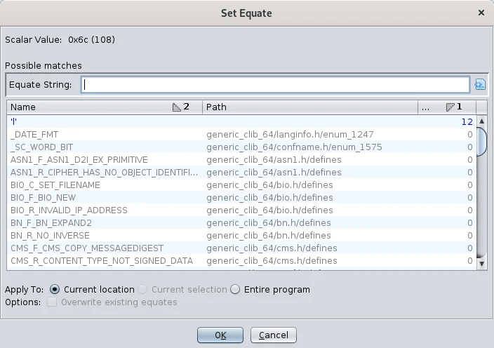
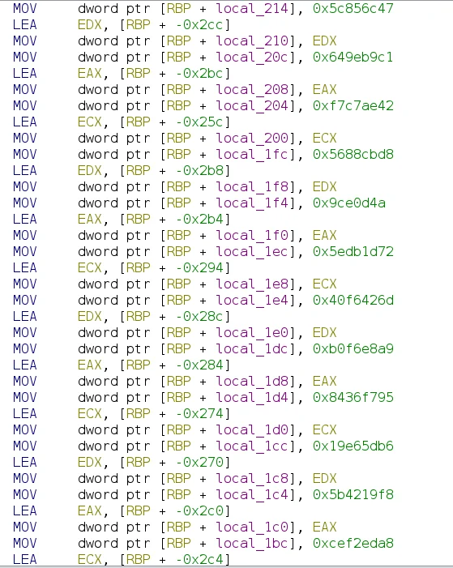
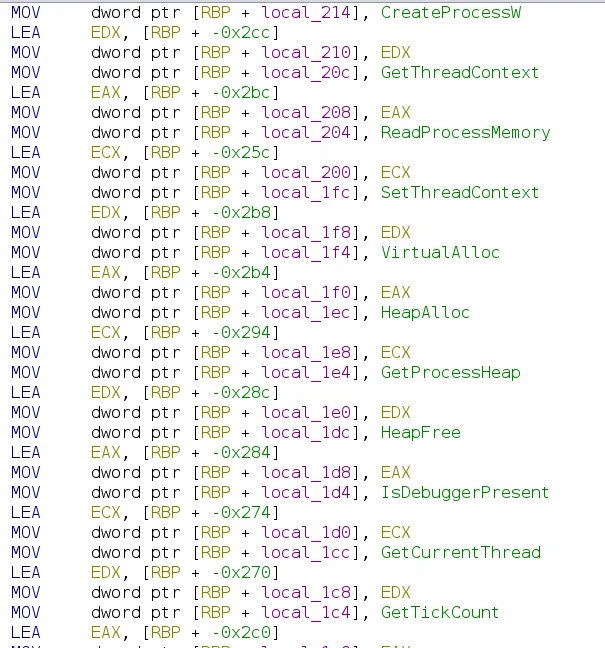

# Scripting Ghidra - Set Equate

In the third installment of this series (if you haven't read/seen here's - [part 1](20200508-scripting-ghidra.md), [part 2](20200707-automating-ghidra-part-2.md) and [part 3](20210410-automating-ghidra-part-3.md)) we will be using the Set Equate functionality in an automatic fashion.

* * *

Note: If you prefer watching, have a look at my [YouTube channel](https://www.youtube.com/channel/UCCt61WyhWeHvLVMbgbpvvYw).

[Watch on YouTube](https://www.youtube.com/watch?v=d-RMxQowkwM)

Looking at raw assembly with all the opcodes and hex values can be challenging. Ghidra allows us to substitute hex values with their string representation to make understanding easier. It also includes a comprehensive list of common names and values that we can use.

While Ghidra includes a comprehensive list of common names and values, we often encounter less common values that we also want to translate, such as hashes for Windows API functions that will later resolve to function addresses. To display these function names directly in the disassembly, we can either manually apply names or write a script to automate this process.

Initial disassembly code

We can start the script by loading a list of hashes with their corresponding names. Here’s a list that we can use to feed into our script...
[code]
    # C:\Windows\System32\kernel32.dll
    AcquireSRWLockExclusive,0x4784e83e
    AcquireSRWLockShared,0x23c00487
    ActivateActCtx,0x6aa0c20c
    AddAtomA,0x7f449663
    AddAtomW,0x8b902332
    AddConsoleAliasA,0x3be718de
    AddConsoleAliasW,0xcf33ad8f
    AddIntegrityLabelToBoundaryDescriptor,0x3af410d5
    AddLocalAlternateComputerNameA,0x9ea1c8ac
    AddLocalAlternateComputerNameW,0x6a757dfd
    AddRefActCtx,0x5d41574a
    AddSIDToBoundaryDescriptor,0x2a3a39ad
    ...
[/code]

Saving this into `api_hashes.txt` we can move to the script.
[code]
    from ghidra.app.cmd.equate import SetEquateCmd
    from os import path

    current_dir = path.dirname(path.realpath(__file__))
    file_name = path.join(current_dir, 'api_hashes.txt')
    data = {}
    with open(file_name,'r') as f:
      data = dict([(v,k) for k,v in [l.split(',') for l in f.read().splitlines() if '#' not in l]])
[/code]

This part of the script will read the aforementioned file and populate the variable `dict` with API hashes as keys and their corresponding names as values. Additionally, lines that start with `#` will be skipped, as these are provided in the file as comments.

Once this setup is complete, we can start replacing hash values in the disassembly. In this example, the hashes appear at regular intervals, so we can use a simple loop with a predefined step. In a more complex scenario, we would need a more sophisticated approach to handle all cases.
[code]
    start_addr = 0x2ba
    end_addr = 0x66c
    step = 0x16
    for addr in range(start_addr, end_addr+1, step):
       #do the replace - code to follow
[/code]

To replace a value with a name, we will use `SetEquateCmd` Ghidra APIs. But to use it, we need a couple for values.
[code]
    i = getInstructionAt(toAddr(addr))
    v = i.getScalar(1)
    key = v.toString(16, False, False, '0x', '')
    if key not in data:
      continue
    name = data[key]
    e = SetEquateCmd(name, toAddr(addr), 1, v.getValue())
[/code]

First, we extract the instruction at a specific address using `getInstructionAt` in conjunction with `toAddr`, which converts a number to an address.

Next, we extract the hash used in the instruction `MOV dword ptr [RBP + local_214], 0x5c856c47`. Based on that value, we can find the corresponding name to replace the hash. Finally, we create a `SetEquateCmd` using the information we’ve gathered.

To apply the change, we call `e.applyTo(currentProgram)`. And that’s it—the script is short but effective.
[code]
    from ghidra.app.cmd.equate import SetEquateCmd
    from os import path

    current_dir = path.dirname(path.realpath(__file__))
    file_name = path.join(current_dir, 'api_hashes.txt')
    data = {}
    with open(file_name,'r') as f:
      data = dict([(v,k) for k,v in [l.split(',') for l in f.read().splitlines() if '#' not in l]])

    start_addr = 0x2ba
    end_addr = 0x66c
    step = 0x16
    for addr in range(start_addr, end_addr+1, step):
        i = getInstructionAt(toAddr(addr))
        v = i.getScalar(1)
        key = v.toString(16, False, False, '0x', '')
        if key not in data:
            continue
        name = data[key]
        e = SetEquateCmd(name, toAddr(addr), 1, v.getValue())
        e.applyTo(currentProgram)
[/code]

We need to save it along with the `api_hashes.txt` file and run.

Disassembly after running the script.
