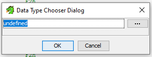
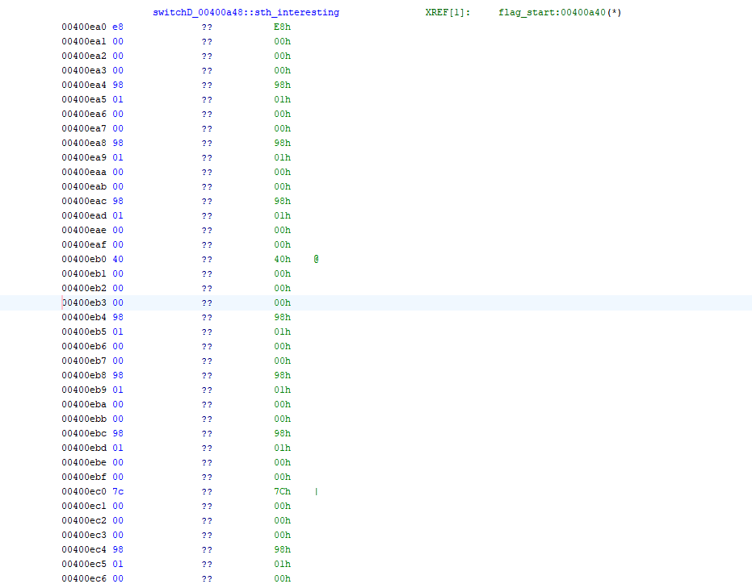
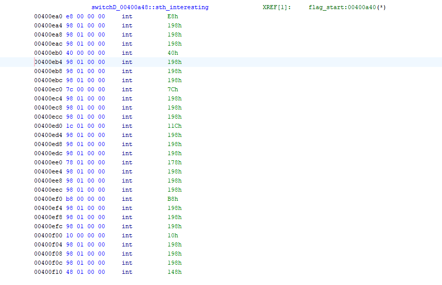

# Scripting Ghidra - Create Data

In the fourth installment of this series (if you haven't read/seen here's - [part 1](20200508-scripting-ghidra.md), [part 2](20200707-automating-ghidra-part-2.md), [part 3](20210410-automating-ghidra-part-3.md) and [part 4](20241113-scripting-ghidra-set-equate.md)) we will be using the `CreateData()` functionality in an automatic fashion.

* * *

Ghidra supports many distinct types and setting them correctly can help understand the disassembly better. We can manually change the type of undefined data using the UI with `Data Type Chooser Dialog`, or if we have quite a few elements to change - we can automate.

Data Type Chooser Dialog

Lets check this part of the code.
[code]
    switchD_00400a48::sth_interesting
                00400ea0 e8              ??           E8h
                00400ea1 00              ??           00h
                00400ea2 00              ??           00h
                00400ea3 00              ??           00h
                00400ea4 98              ??           98h
                00400ea5 01              ??           01h
                00400ea6 00              ??           00h
                00400ea7 00              ??           00h
                00400ea8 98              ??           98h
                00400ea9 01              ??           01h
                00400eaa 00              ??           00h
                00400eab 00              ??           00h
                00400eac 98              ??           98h
                00400ead 01              ??           01h
                00400eae 00              ??           00h
                00400eaf 00              ??           00h
                00400eb0 40              ??           40h    @
                00400eb1 00              ??           00h
                00400eb2 00              ??           00h
                00400eb3 00              ??           00h
[/code]

The bytes define and offset that is used to address some code section in a different part of the assembly. We can apply an int type to them for better visibility. For this example we will use Ghidra’s flat API that is available  from Python.

Let’s jump to the text editor.
[code]
    ptr_type = getDataTypes("int")[0]
[/code]

First we use the `getDataTypes` method passing the type we want to apply to our bytes. This method returns an array, so we pick the first type returned.

Next thing…oh wait, that’s already it. We can use `createData` with our type to convert.
[code]
    for addr in range(0x00400ea0,0x00400f14,4):
        createData(toAddr(addr), ptr_type)
[/code]

To convert a value to an address we can use already known helper method - `toAddr`. Let’s see this code in action.

Before and after executing the script

And again, that’s it  \- very, very short code that allows applying a specified type to a range of bytes.
