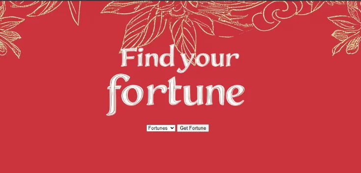
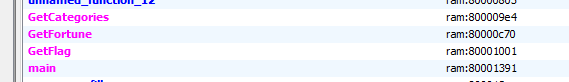

# 1753CTF - 🍀Luck, 🤷‍♂️ Free Flag and 🔮 Fortune

Had a couple of hours this Friday, so I spontaneously decided to participate in the 1753 CTF. I attempted a few challenges and managed to get First Blood on _Fortune_.

## 🍀 Luck (PWN)
[code]
    PWN // ​🍀 Luck  (Score: 100 / Solves: 74)
    ​
    Lucky enough?

    nc luck-c87cea04b0d4.tcp.1753ctf.com 16448

    💾 https://get.1753ctf.com/luck/src/luck.csproj?s=uVB1dasG
    💾 https://get.1753ctf.com/luck/src/Program.cs?s=kCQya1vE
    💾 https://get.1753ctf.com/luck/Dockerfile?s=YpLTHc0V
[/code]

❔

Not sure if that should be in a PWN category.

In this task we are given, .cs file (C# source code), .csproj (C# project file) and a Dockerfile that would allow us to build a challenge locally (if needed).

Looking into `Program.cs`, we can see that it's a simple game involving a Joker. At the start, we can provide a seed, or it will be picked randomly (using `System.Random`). After that, a series of rolls occurs. A number is chosen for both us and the Joker. Our number is picked from the range [1; 7), while our opponent has a slight advantage, as his values are picked from [5; 7). The selected values are added to the player's and Joker's scores, respectively. The game continues until either score is greater than or equal to 100. If, at that point, our score is higher than the Joker's, we win and receive the flag.

### Getting the flag

We need to generate conditions that make the game play in our favor. Since we control the seed, we can try generating one where the rolls give us a better score. The first idea is to brute-force a couple of combinations to see if any yield a desirable value.

To do that, let's first strip anything unnecessary from the main game logic. We don’t need any `Console.WriteLine` calls or input reading. A simplified version can look like this:
[code]
    static bool Check(string seed)
    {
        var rng = new Random(GetSeed(seed));

        var playerScore = 0;
        var jokerScore = 0;

        while (playerScore < 100 && jokerScore < 100)
        {
            var playerRoll = rng.Next(1, 7);
            var jokerRoll = rng.Next(5, 7);

            playerScore += playerRoll;
            jokerScore += jokerRoll;
        }

        return playerScore > jokerScore;
    }

     static int GetSeed(string? input)
    {
        if (string.IsNullOrWhiteSpace(input))
            return Environment.TickCount;

        var hash = SHA256.HashData(Encoding.UTF8.GetBytes(input));
        return BitConverter.ToInt32(hash, 0);
    }
[/code]
[code]
    for (byte b0 = 0x20; b0 <= 0x7f; b0++)
    {
        for (byte b1 = 0x20; b1 <= 0x7f; b1++)
        {
            for (byte b2 = 0x20; b2 <= 0x7f; b2++)
            {
                for (byte b3 = 0x20; b3 <= 0x7f; b3++)
                {
                    string seed = Convert.ToChar(b3).ToString() +
                                  Convert.ToChar(b2) + Convert.ToChar(b1) +
                                  Convert.ToChar(b0);
                    if (Check(seed))
                    {
                        Console.WriteLine($"Found: {seed}");
                        break;
                    }
                }
            }
        }
    }
[/code]

For seeds of length 3 or less, nothing useful was found, but running it with 4-character seeds produces a few values that we can use.

> Found: dcL#
> Found: t-|1
> Found: PEe<
> Found: MU+>

I've used used the first one: `dcL#`.

Providing this seed to the remote instance allows us to win and get the flag: `1753c{wh4t_4n_1ncred1ble_luck_1t_w4sss}`.

## 🤷‍♂️ Free Flag
[code]
    WEB/CRYPTO // ​🤷‍♂️ Free Flag  (Score: 100 / Solves: 58)

    Well, this task worked for me before the CTF, but now it seems to be broken. I will fix it on Monday, I promise.
    ​
    🔗 https://free-flag-2e5714cdf314.1753ctf.com/
[/code]

[Watch on YouTube](https://www.youtube.com/watch?v=73NTp2e3jNI)

Visiting the URL presents the flag, but something feels off.

> The flag is:
> 1753c{$2g9Z/8>?_#k{_d%Z*dt\u:p?jhf`4}
[code]
    async function getFlag() {
        const flag = [0x45,0x00,0x50,0x39,0x08,0x6f,0x4d,0x5b,0x58,0x06,0x66,0x40,0x58,0x4c,0x6d,0x5d,0x16,0x6e,0x4f,0x00,0x43,0x6b,0x47,0x0a,0x44,0x5a,0x5b,0x5f,0x51,0x66,0x50,0x57]
        const tz = Intl.DateTimeFormat().resolvedOptions().timeZone;
        const resp = await fetch("https://timeapi.io/api/time/current/zone?timeZone=" + tz);
        const date = await resp.json();
        const base = date.timeZone + "-" + date.date + "-" + date.time;
        var hash = CryptoJS.MD5(base).toString();

        const result = flag.map((x, i) => String.fromCharCode(x ^ hash.charCodeAt(i))).join('')
        document.querySelector('span').innerText = result;

        document.getElementsByClassName('ready')[0].style.display = 'block';
        document.getElementsByClassName('loading')[0].style.display = 'none';
    }

    getFlag();
[/code]

What’s happening here is that we have an encrypted flag (`const flag`). Next, the time zone (`const tz`) is retrieved, and based on that, a request is made to `timeapi.io` for the current date and time information. The server response is parsed, and a base string is constructed by concatenating the time zone with the date and time: `const base = date.timeZone + "-" + date.date + "-" + date.time;`

This string serves as the input to the MD5 hash function. The resulting hash is then used as a key to decrypt the flag using a simple XOR operation: `const result = flag.map((x, i) => String.fromCharCode(x ^ hash.charCodeAt(i))).join('')`.

So, to correctly decrypt the flag, we need to know **when** the encrypted data was generated.

### Getting the flag

The challenge description provided a few hints. It stated, _"it worked for me before the CTF"_ and _"I will fix it on Monday"_. So maybe the correct date was an earlier time on the day of the CTF, or perhaps the **next** Monday was used for encryption. In either case, there aren’t that many possibilities to try, so brute-forcing is feasible.

There's still one unknown: the time zone. Running the code gave me `Europe/Warsaw`, and I assumed it was the same for the challenge authors — though that may not necessarily be true. I started with that assumption.

The sample MD5 input looked like this: `Europe/Warsaw-04/11/2025-21:37`. So for the CTF day, we can simply generate all possible hour and minute combinations and check whether any resulting hash correctly decrypts the flag.

The hard part is detecting whether the decrypted string is actually the flag. The flag prefix isn’t part of the encrypted value, so we can’t rely on it as a marker. However, one heuristic we **can** use is that a real flag should consist entirely of printable ASCII characters.
[code]
    import hashlib
    flag = [0x45,0x00,0x50,0x39,0x08,0x6f,0x4d,0x5b,0x58,0x06,0x66,0x40,0x58,0x4c,0x6d,0x5d,0x16,0x6e,0x4f,0x00,0x43,0x6b,0x47,0x0a,0x44,0x5a,0x5b,0x5f,0x51,0x66,0x50,0x57]

    def xor(f, key):
        return ''.join([chr(x ^ ord(k)) for (x,k) in zip(f, key)])

    for h in range(0, 24):
        for m in range(0, 60):
            k = f'Europe/Warsaw-04/11/2025-'+f'{h:02}:{m:02}'
            d = hashlib.md5(k.encode()).hexdigest()
            r = xor(flag, d)
            if all([ord(x) >= 0x20 and ord(x) < 0x7f for x in r]):
                print(f'Found? {r} {k}')
[/code]

Running this yields a few results that pass basic checks, but none of them appear to be correct.
[code]
    Found? |8e]i]x:k7Wp>y^o$^)9%Y#nrnoj2W2c Europe/Warsaw-04/11/2025-01:52
    Found? #eb]kW/=`5T$k*Y8w\{7{R#>tcm>aRgo Europe/Warsaw-04/11/2025-02:08
    Found? $ff_?_)ia6WpmzUepY,2s_tkqbo>7_do Europe/Warsaw-04/11/2025-02:56
    Found? |03[;\.n<gV!k)^ntW)7uSp=|m9fi^b5 Europe/Warsaw-04/11/2025-03:01
    Found? vehZm^(bibRu9x];wY+ds]v;!;l<7Tce Europe/Warsaw-04/11/2025-03:02
    Found? &8eXmZznm1Syix[dtY}cwS&o nojcS53 Europe/Warsaw-04/11/2025-03:57
    Found? $1h]=[/bmeR$9)^j#V-fzRroq>lkiWib Europe/Warsaw-04/11/2025-05:50
    Found? t73\?^z?=4_&;/\m"[-8qZpk&h9jhQeo Europe/Warsaw-04/11/2025-07:17
    Found? !1h]i_x896Tw={^m'X,bzXq8'>9gaP3d Europe/Warsaw-04/11/2025-07:49
    Found? p26\:_)lld^$`|Ym!Y)8u[s2 >jh3R2c Europe/Warsaw-04/11/2025-10:07
    Found? t0`XjWzohgRx`xZ>rX|9{_~=q>kodS24 Europe/Warsaw-04/11/2025-10:13
    Found? q0h]lX~bj2RplzZo.Yy1pRwlpbck4Sda Europe/Warsaw-04/11/2025-10:31
    Found? }ch\k^}8=2U!l(X9rY*6pX">rnn>3Pb4 Europe/Warsaw-04/11/2025-10:43
    Found? v8`];V/m9dUvh{]9%W)9v]s?w;b;iQ45 Europe/Warsaw-04/11/2025-11:27
    Found? |7f[k\{cn0^vayUi!Y.1sSu; ?9;7Q6c Europe/Warsaw-04/11/2025-13:07
    Found? p2b]1Zy8:`_sh{Yi"_*czYw8sm8=5W3e Europe/Warsaw-04/11/2025-13:25
    Found? '2i\8\+k;7^xh~]9wX)dp[&;sck:fWac Europe/Warsaw-04/11/2025-15:12
    Found? tb1]k]z?=2Tx;{[<!^)f{S!hu?8of^1c Europe/Warsaw-04/11/2025-15:51
    Found? w2i]<\yo>6Q$l-[d/W)6q[~9!9hf2Ven Europe/Warsaw-04/11/2025-16:58
    Found? u7g_;^u:odVshu\<&W-5rRtn&9jkd^dd Europe/Warsaw-04/11/2025-17:53
    Found? r24Z<[)la5Rwnu_mtVycp\qk%8n;aQi2 Europe/Warsaw-04/11/2025-18:38
    Found? vea\m]{h>dWx>}]dtY|0"Z$;thn;3Tg1 Europe/Warsaw-04/11/2025-19:33
    Found? t11X8_{?`>^"hy_<t\vd'[p9&>=>2Sgo Europe/Warsaw-04/11/2025-21:31
    Found? #diXnWybndRx:}^h"X}0 ^"9}lm9`W55 Europe/Warsaw-04/11/2025-22:28
    Found? r51X>[/99?Ty;}Ud&Yx1 _w=%nh94^`6 Europe/Warsaw-04/11/2025-23:35
    Found? !73]lZuc:6Pyl~Xl#].7"_%i";bn`Pc6 Europe/Warsaw-04/11/2025-23:59
[/code]

Trying the Monday date (15.04) also didn't give anything useful. Other options included checking different time zones or going further back in time. During the CTF, I initially chose the wrong approach and checked various time zones for 11.04 and 15.04. Only later did I consider older dates.

Adding a third dimension (e.g., hours and minutes) generates even more values that pass simple checks (like being printable characters), but still aren't the correct flag. To reduce the number of false positives, I added entropy calculation (based on [this gist](https://gist.github.com/nstarke/bc662d2858756f4812d74f7fb3eab28a)).

Final solver:
[code]
    import hashlib
    import string
    import math
    flag = [0x45,0x00,0x50,0x39,0x08,0x6f,0x4d,0x5b,0x58,0x06,0x66,0x40,0x58,0x4c,0x6d,0x5d,0x16,0x6e,0x4f,0x00,0x43,0x6b,0x47,0x0a,0x44,0x5a,0x5b,0x5f,0x51,0x66,0x50,0x57]

    def xor(f, key):
        return ''.join([chr(x ^ ord(k)) for (x,k) in zip(f, key)])

    def shannon_entropy(data):
        """
        Adapted from http://blog.dkbza.org/2007/05/scanning-data-for-entropy-anomalies.html
        by way of truffleHog (https://github.com/dxa4481/truffleHog)
        """
        if not data:
            return 0
        entropy = 0
        for x in string.printable:
            p_x = float(data.count(x)) / len(data)
            if p_x > 0:
                entropy += - p_x * math.log(p_x, 2)
        return entropy

    for day in range(0, 29):
        for h in range(0, 24):
            for m in range(0, 60):
                k = f'Europe/Warsaw-02/{day:02}/2025-'+f'{h:02}:{m:02}'
                d = hashlib.md5(k.encode()).hexdigest()
                r = xor(flag, d)
                ent = shannon_entropy(r)
                if all([ord(x) >= 0x20 and ord(x) < 0x7f for x in r]) and ent <= 4.0:
                    print(f'Found? {r} {k}')
[/code]

ℹ️

During the CTF, run this for January - 01 first, then proceed to February - 02.

Running this would give us the flag:

> ❯ python3 solve.py
> Found? see_i_told_you_it_was_working_b4 Europe/Warsaw-02/13/2025-20:37

🔮 Fortune (REV/WEB) - 🩸
[code]
    REV/WEB // ​🔮 Fortune  (Score: 380 / Solves: 13)

    This website use state of the art AI algorithm to find wisdom that fits your needs! Now it's gonna be easy!

    🔗 https://fortune-ca29a1bd80cd.1753ctf.com/
[/code]

Visiting the URL, shows a simple web page.

But we can quickly spot the `wasm` file and a `javascript` that works together with it.
[code]
    var Module = {
        onRuntimeInitialized: function() {
            // Create wrapped functions that can be called from JavaScript
            window.getCategories = Module.cwrap('GetCategories', 'string', [], { async: true });
            window.getFortune = Module.cwrap('GetFortune', 'string', ['string'], { async: true });

            // Load categories when WASM is ready
            loadCategories();
        }
    };

    async function loadCategories() {
        try {
            const categoriesJson = await window.getCategories();

            try {
                // Parse JSON and populate dropdown
                const categories = JSON.parse(categoriesJson);
                const select = document.getElementById('categorySelect');
                select.innerHTML = '';

                categories.forEach(category => {
                    const option = document.createElement('option');
                    option.value = category;
                    option.textContent = category;
                    select.appendChild(option);
                });
            } catch (parseError) {
                console.error('Error parsing categories JSON:', parseError);
            }
        } catch (e) {
            console.error('Error loading categories:', e);
            document.getElementById('categories').textContent = 'Error loading categories';
        }
    }

    document.getElementById('getFortune').addEventListener('click', async function() {
        try {
            const category = document.getElementById('categorySelect').value;
            const fortuneJson = await window.getFortune(category);
            document.getElementById('fortune').innerHTML = fortuneJson;
        } catch (e) {
            console.error('Error getting fortune:', e);
            document.getElementById('fortune').textContent = 'Error getting fortune';
        }
    });
[/code]

Throwing the `.wasm` into Ghidra, we can spot that—apart from `GetCategories` and `GetFortune`—there’s also a `GetFlag` method.

ℹ️

Ghidra needs a plugin to correctly work with `wasm`. I've used this one <https://github.com/nneonneo/ghidra-wasm-plugin>

The method itself doesn't contain much interesting logic. `GetFlag` is quite similar to `GetFortune`, with the main difference being the endpoint used:
`/api/v1.03.410/verify-my-flag/%s`.
My first idea was that maybe it's vulnerable to a timing attack?

### Getting the flag (binary)

Initially suspecting a possible timing attack, I wrote a simple JS script to iterate over characters and see if we could infer anything based on response times.
[code]
    window.getFlag = Module.cwrap('GetFlag', 'string', ['string'], { async: true });

    const div = document.createElement("div");
    div.id = "flag";
    document.body.appendChild(div);

    const button = document.createElement("button");
    button.id = "getFlag";
    button.innerText = "getFlag";
    document.body.appendChild(button);

    document.getElementById('getFlag').addEventListener('click', async function() {
    try {
        for (i = 32; i <= 127; i++) {
            const flag = String.fromCharCode(i);
            var startTime = performance.now();
            const flagJson = await window.getFlag(flag);
            var endTime = performance.now()
            console.log(flagJson + `For ${flag} it took: ${endTime - startTime}`);
            document.getElementById('flag').innerHTML = flagJson + `Took: ${endTime - startTime}`;
        }
    } catch (e) {
        console.error('Error getting flag:', e);
        document.getElementById('flag').textContent = 'Error getting flag';
    }
    });
[/code]

However, the response timings were inconsistent—some requests resulted in server errors, some in 404s, but one stood out. Running it with an `&` at the end returned: `{"result":"Usage: /app/flag <secret>"}`.

Looks like we discovered a **command injection** vulnerability. With that, we can use something like `& ls` to inspect the server environment. Eventually, we can dump the flag binary using: `& cat flag | base64`. We save the output and decode it from base64 to retrieve the binary.

### Getting the flag (real one)

With the binary in hand, we load it into Ghidra and begin reversing.
[code]
    undefined8 main(int argc,undefined8 *argv)
    {
      int iVar1;
      undefined8 uVar2;

      if (argc < 2) {
        printf("Usage: %s <secret>
",*argv);
        uVar2 = 1;
      }
      else {
        iVar1 = isFlag(argv[1],"denied","xdxd");
        if (iVar1 < 1) {
          puts("Nope.");
        }
        else {
          puts("Yes, that\'s the flag");
        }
        uVar2 = 0;
      }
      return uVar2;
    }
[/code]

The `isFlag` function is a bit more complex.
[code]
      if (((_len == 0x1e) && (pcVar3 = strchr(local_c0,L'{'), pcVar3 != 0x0)) &&
         (pcVar3 = strchr(local_c0,L'}'), pcVar3 != 0x0)) {
        _1753c = strsep(&local_c0,"{");
        _flag_body = strsep(&local_c0,"}");
[/code]

We know the flag must be 30 characters long and include curly braces. There’s also code that extracts the `1753c` prefix from the input using `strsep`, separating it from the rest of the flag.

Since we now have the binary, we can fire up a debugger and observe what's happening internally. We know we must pass the entire flag (including prefix) as our secret—so 30 characters in total.

Stepping through the function reveals some operations involving the flag input, but near the end of the function is the part we care about.
[code]
    0x555555555586 <isFlag+989>     cmp    byte ptr [rbp - 0x25], al
    0x555555555589 <isFlag+992>     je     isFlag+1001                <isFlag+1001>
[/code]

In the `al` register, we find the character from our input. At `[rbp - 0x25]`, we can find the **correct flag character** expected by the program. We can collect characters directly from that memory location. By manually setting `al` to match the expected character, we avoid triggering the `je` condition that would break the loop—and eventually, we extract the full flag: `1753c{m4y_f0rtun3_b3_w1th_y0u}`.

* * *

This CTF offered a really enjoyable mix of challenges, each requiring a different mindset and set of skills. The first one, written in C#, was a fun exercise in understanding pseudo-random behavior and using controlled seeds to tilt the odds in our favor. The second relied on carefully reconstructing time-based inputs and hashing logic — demanding both patience and a bit of creative guesswork. Finally, the command injection task was a classic case of “poke until it breaks,” followed by low-level binary reversing to pull out the flag character by character.

What tied them all together was the need to dig just a little deeper — to read between the lines, to try the odd idea, and to trust that every small clue might matter. Solid challenges, subtle hints, and satisfying conclusions.

**Happy reversing!**
