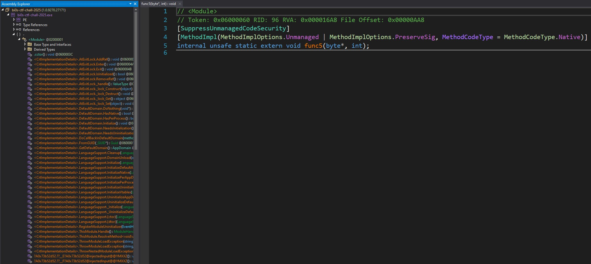
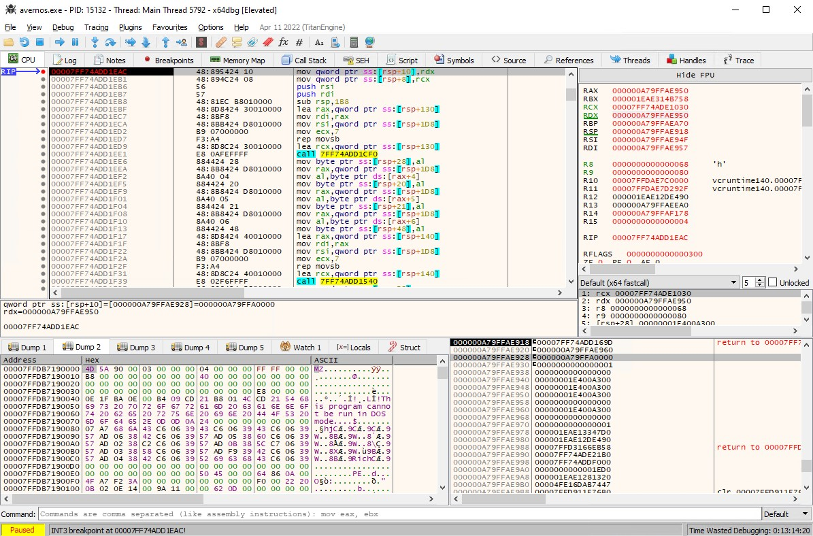
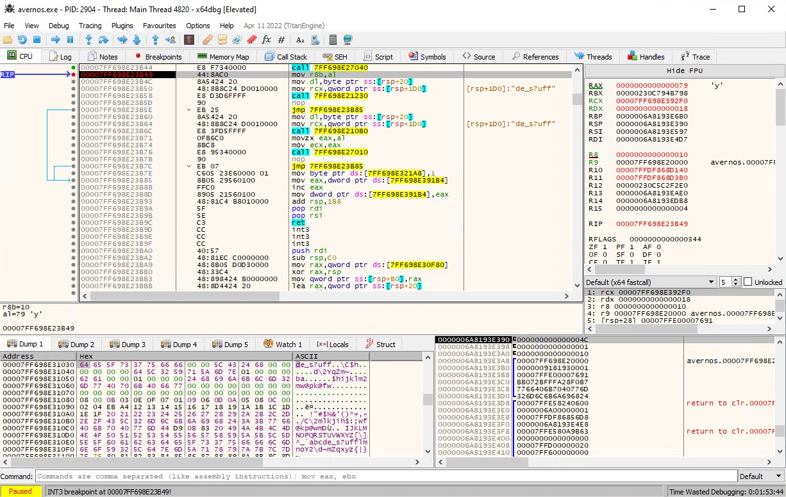
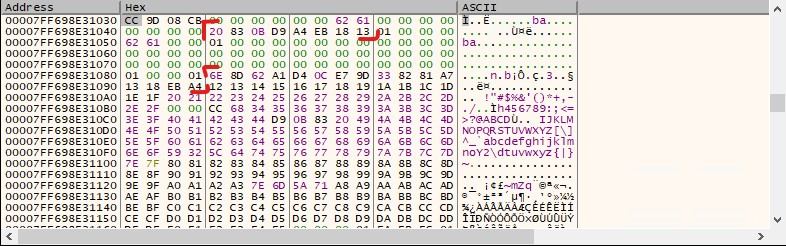

# avernos

**Avernos** was one of the reverse engineering (RE) challenges from the recent bi0s CTF. It was solved by 18 teams and was worth 838 points. I managed to solve it during the CTF, although I struggled with part of the task. The solution I came up with might be interesting to document - so let's start.

The description reads:

> An ancient engine stirs in the dark. It speaks no language you know.  
> Flag Format: bi0s{...}

We're given an attachment: `avernos.exe`. Running the `file` command on the binary reveals that it's a .NET executable:

> ❯ file avernos.exe  
> avernos.exe: PE32+ executable (console) x86-64 Mono/.Net assembly, for MS Windows

So this should be an easy one, right? Before jumping into the analysis we can give it a quick spin. When executed, it does not print anything and awaits user input.

## Initial analysis - .NET part

Since it is a .NET binary we start by opening it in `dnSpy`. We can already tell that it might not be your typical Sunday .NET reversing exercise.  
The list of methods looks strange, and some of them are marked as `extern`. Looks like definitely some shenanigans are happening here.



*dnSpy methods list look suspicious*

Looking around in dnSpy, we can identify a few interesting spots:

`func6` appears to contain the main logic of the binary, with the following code:

```csharp
internal unsafe static void func6()
{
    string text = Console.ReadLine();
    Regex regex = new Regex("^bi0s{([a-zA-Z0-9_]+)}$");
    Match match = regex.Match(text);
    if (match.Success)
    {
        string value = match.Groups[1].Value;
        <Module>.func11();
        IntPtr intPtr = Marshal.StringToHGlobalAnsi(value);
        <Module>.strcpy_s((sbyte*)(&<Module>.user_input), 0x80UL, (sbyte*)intPtr.ToPointer());
        Marshal.FreeHGlobal(intPtr);
        <Module>.func8((sbyte*)(&<Module>.user_input));
        <Module>.func1();
    }
    else
    {
        Environment.Exit(1);
    }
}
```

From that we can spot what the expected flag format is and that we only pass what's inside `{}` to be verified. We knew that from the description but now we know what characters are expected inside `{}`. And if we match the regex check we execute `func11`, `func8` and `func1` and doing some manual memory management in between.

`func8` and `func1` code is available, but `func11` is marked as external. We'll focus on the first two for now:

`func8`
```csharp
internal unsafe static void func8(sbyte* input)
{
    <Module>.msclr.gcroot<System::String\u0020^>.=(&<Module>.?A0x73b52d52.injectedInput, new string((sbyte*)input));
    <Module>.?A0x73b52d52.injectedIndex = 0;
}
```

It looks like what the code does here is setting the `injectedInput` to be equal to the string passed as `input`. We are also setting `injectedIndex` to `0`.
This is probably setting some data for the real fun.

`func1`
```csharp
internal unsafe static void func1()
{
    if (<Module>.global_flag != 1)
    {
        Environment.Exit(1);
    }
    <Module>.func27();
    <Module>.func5((byte*)(&<Module>.embedded_instructions), 0x1ED1);
    <Module>.func23();
    int num = <Module>.func18();
    if (*((ref <Module>._err_token) + 0x52 + (long)num) == 0)
    {
        <lambda_7b8f7c1aa6b0ebbbec3baa92a10e10b7> <lambda_7b8f7c1aa6b0ebbbec3baa92a10e10b7>;
        initblk(ref <lambda_7b8f7c1aa6b0ebbbec3baa92a10e10b7>, 0, 1L);
        _err_tok_2<7,0> err_tok_2<7,0>;
        <Module>.printf(<Module>._err_tok_2<7,0>.decrypt(<Module>.func1.<lambda_7b8f7c1aa6b0ebbbec3baa92a10e10b7>.()((<lambda_7b8f7c1aa6b0ebbbec3baa92a10e10b7>*)(&<lambda_7b8f7c1aa6b0ebbbec3baa92a10e10b7>), &err_tok_2<7,0>)), __arglist());
        <Module>.exit(0);
    }
    <lambda_80864a03a1c3fa5fa295ad64a1df9c07> <lambda_80864a03a1c3fa5fa295ad64a1df9c07>;
    initblk(ref <lambda_80864a03a1c3fa5fa295ad64a1df9c07>, 0, 1L);
    _err_tok_2<9,0> err_tok_2<9,0>;
    <Module>.printf(<Module>._err_tok_2<9,0>.decrypt(<Module>.func1.<lambda_80864a03a1c3fa5fa295ad64a1df9c07>.()((<lambda_80864a03a1c3fa5fa295ad64a1df9c07>*)(&<lambda_80864a03a1c3fa5fa295ad64a1df9c07>), &err_tok_2<9,0>)), __arglist());
}
```

This one is a bit longer. Without diving into all the code details, here's a summary:

- `func27` decrypts data stored in `embedded_instructions`, which is then passed to an external `func5`. Once that returns, control flows to another external function - `func23`.
- `func18` performs some obscure number operations, but ultimately returns `0xED`.

Next, we encounter a conditional branch, but both branches perform similar calls - including one to `printf`. The difference lies in the argument passed to `printf`, which is generated via a call to a `decrypt` function, each with a different lambda.

If we look at the lambdas and the `decrypt` function:

```csharp
internal unsafe static _err_tok_2<7,0>* func1.<lambda_7b8f7c1aa6b0ebbbec3baa92a10e10b7>.()(<lambda_7b8f7c1aa6b0ebbbec3baa92a10e10b7>* A_0, _err_tok_2<7,0>* A_1)
{
    _err_tok_2<7,0> err_tok_2<7,0> = 0xEF;
    *((ref err_tok_2<7,0>) + 1) = 0xEA;
    *((ref err_tok_2<7,0>) + 2) = 0x7D;
    // ...more bytes for the next indices
    *((ref err_tok_2<7,0>) + 0xC) = 0x5C;
    *((ref err_tok_2<7,0>) + 0xD) = 0xD9;
    cpblk(A_1, ref err_tok_2<7,0>, 0xE);
    return A_1;
}

internal unsafe static _err_tok_2<9,0>* func1.<lambda_80864a03a1c3fa5fa295ad64a1df9c07>.()(<lambda_80864a03a1c3fa5fa295ad64a1df9c07>* A_0, _err_tok_2<9,0>* A_1)
{
    _err_tok_2<9,0> err_tok_2<9,0> = 0xEF;
    *((ref err_tok_2<9,0>) + 1) = 0xEA;
    *((ref err_tok_2<9,0>) + 2) = 0x7D;
    // ...more bytes for the next indices
    *((ref err_tok_2<9,0>) + 0x10) = 0xD6;
    *((ref err_tok_2<9,0>) + 0x11) = 0x37;
    cpblk(A_1, ref err_tok_2<9,0>, 0x12);
    return A_1;
}

internal unsafe static sbyte* _err_tok_2<9,0>.decrypt(_err_tok_2<9,0>* A_0)
{
    for (ulong num = 0UL; num < 8UL; num += 1UL)
    {
        ref byte ptr = ref *(byte*)(A_0 + 9L / (long)sizeof(_err_tok_2<9,0>) + num / (ulong)sizeof(_err_tok_2<9,0>));
        byte* ptr2 = A_0 + num / (ulong)sizeof(_err_tok_2<9,0>);
        sbyte b = (sbyte)(ptr ^ (*ptr2 & byte.MaxValue));
        *(byte*)(A_0 + 9L / (long)sizeof(_err_tok_2<9,0>) + num / (ulong)sizeof(_err_tok_2<9,0>)) = (byte)b;
    }
    *(byte*)(A_0 + 9L / (long)sizeof(_err_tok_2<9,0>) + 8L / (long)sizeof(_err_tok_2<9,0>)) = 0;
    return A_0 + 9L / (long)sizeof(_err_tok_2<9,0>);
}

internal unsafe static sbyte* _err_tok_2<7,0>.decrypt(_err_tok_2<7,0>* A_0)
{
    // Same code as `_err_tok_2<9,0>.decrypt`, just iterating over a shorter range of 7 characters
}
```

It looks cryptic at first, but upon closer inspection, it's just a simple xor between parts of the data from the lambdas. One half is the key, the other the data - or vice-versa, since xor is symmetric.

A quick Python script reveals the output:

```python
a = [0xef, 0xea, 0x7d, 0xb0, 0x93, 0x56, 0xd9, 0xdc, 0x37, 0xac, 0x85, 0x0f, 0xc2, 0xf6, 0x35, 0xad, 0xd6, 0x37]
''.join([chr(a[i] ^ a[i+9]) for i in range(len(a)//2)])
'Correct\n\x00'
```

And for the other lambda, the result is 'Wrong\n\x00'.

So we've identified a flag check mechanism that selects between "Correct" and "Wrong" based on the decrypted result.

Enough of the .NET side - let's go native now.

## Initial analysis - Native part

During the analysis of the of the .NET part, there were functions that were missing implementation. They have to be somewhere. Lets open the binary in Ghidra.

In the native part we can locate the missing functions: `func5` and `func23`. The first one does some initialization and the second one eventually calls to `FUNC_140001eac` which looks like some VM instruction dispatch routine :(

```c
    // ... cut for brevity
    else if (bVar3 == 0x3b) {
        uVar15 = FUN_1400010b0(param_1, bVar1);
        FUN_140001230(param_1, bVar1, (uVar15 & 0xff) >> (bVar2 & 0x1f));
    }
    else if (bVar3 == 0x46) {
        uVar15 = FUN_1400010b0(param_1, bVar1);
        uVar18 = FUN_1400010b0(param_1, bVar1);
        FUN_140001230(param_1, bVar1,
            (uVar15 & 0xff) << (bVar2 & 0x1f) |
            (uVar18 & 0xff) >> (0x8 - bVar2 & 0x1f));
    }
    else if (bVar3 == 0x47) {
        uVar15 = FUN_1400010b0(param_1, bVar1);
        uVar18 = FUN_1400010b0(param_1, bVar1);
        FUN_140001230(param_1, bVar1,
            (uVar15 & 0xff) >> (bVar2 & 0x1f) |
            (uVar18 & 0xff) << (0x8 - bVar2 & 0x1f));
    }
    else if (bVar3 == 0x5a) {
        uVar15 = FUN_1400010b0(param_1, bVar2);
        FUN_140001230(param_1, bVar1, uVar15);
    }
}
else if (bVar3 == 0x5c) {
    uVar15 = FUN_1400010b0(param_1, bVar2);
    FUN_140001470(param_1, bVar1, uVar15);
}
else if (bVar3 == 0x5d) {
    uVar4 = FUN_1400013b0(param_1, bVar2);
    FUN_140001470(param_1, bVar1, uVar4);
}
// ... cut for brevity
```

This function is extremely long and contains a lot of branches handling specific opcodes. Without analyzing it in full, we can already see that `param1` (`rcx`) holds some kind of VM state - register values and memory - so we'll need to keep an eye on that.

## Let's go dynamic

During the CTF, I knew this would be difficult to solve purely through static analysis, so I decided to run the binary under x64dbg. The first run wasn't particularly promising, as the binary exited quickly after launching it under the debugger.

Hmm. There was no indications of any anti-debugging techniques during our earlier inspection, but maybe something was missed. Could it be that the binary only performs this check right at the start? Since it waits for user input (we could see that from the initial run, and also from the `Console.ReadLine()` in the .NET part), maybe we can attach the debugger after it gets going?

Bingo. The binary didn't terminate when the debugger was attached after startup. We're good to proceed with dynamic analysis now.

Starting with a breakpoint at `FUN_140001eac`, we can enter an initial flag like `bi0s{abcdefghijklmnopqrstuvwxyz}` to get our first peek into the running program.



*First peek into the opcode dispatch function*

The line that starts dispatching the opcode handlers is: `140001f4f CMP dword ptr [RSP + local_1a4], 0xa0`. So it's a good idea to set another breakpoint there and start observing the VM memory. At that point, the VM state pointer is available in `rcx`, via: `MOV rcx, [RSP + 0x1D0]`.

## Getting the flag

Running the binary couple of times and observing the VM memory we can for sure detect some values that stand out from the rest. An interesting points in the disassembly were `0x91` and `0x92` opcodes.

It's code was as simple for both of them:

```c
      else if (opcode == 0x91) {
        uVar1 = func3();
        set_value(vm,r1,uVar1);
      }
      else if (opcode == 0x92) {
        get_value(vm,r1);
        func4();
      }
```

but the implementation for `func3()` and `func4()` was missing. Checking managed part of the code, reveals that the first one, though a bit cryptic, gets a character from a string in the end. The latter one just prints a value using `Console.Write`. 

```csharp
internal unsafe static int func3()
{
    string text = <Module>.msclr.gcroot<System::String\u0020^>..PE$AAVString@System@@((msclr.gcroot<System::String\u0020^>*)(&<Module>.?A0x73b52d52.injectedInput));
    if (text == null || <Module>.?A0x73b52d52.injectedIndex >= text.Length)
    {
        <Module>.msclr.gcroot<System::String\u0020^>.=(&<Module>.?A0x73b52d52.injectedInput, Console.ReadLine());
        if (string.IsNullOrEmpty(<Module>.msclr.gcroot<System::String\u0020^>..PE$AAVString@System@@((msclr.gcroot<System::String\u0020^>*)(&<Module>.?A0x73b52d52.injectedInput))))
        {
            return 0;
        }
        <Module>.?A0x73b52d52.injectedIndex = 0;
        text = <Module>.msclr.gcroot<System::String\u0020^>..PE$AAVString@System@@((msclr.gcroot<System::String\u0020^>*)(&<Module>.?A0x73b52d52.injectedInput));
    }
    int num = <Module>.?A0x73b52d52.injectedIndex;
    <Module>.?A0x73b52d52.injectedIndex++;
    return text[num];
}

internal static void func4(int val)
{
    Console.Write((char)val);
}
```

The first one looks like an excellent point to continue our investigation. Let's put a breakpoint on the opcode and continue execution.

Running couple of times through this breakpoint shows that it does in fact return consecutive characters from our flag input. We even get, what looks like be the part of the flag for free. When getting the letter `y` from our input, in the VM memory part we can see something that might be part of the flag. We don't know that for sure, but the characters looks too suspicious to be missed.



*l33t sp33k text looks too suspicious to be skipped*

So from now on, it will be incorporated into the flag input: `bi0s{abcdefghijklmnopqrstuvwxde_s7uff}`. Now we only need the remaining 24 characters.

Apart from, what seems to be the last part of the flag, when observing the VM memory we can spot that the flag is processed in patterns. First characters are processed in a different way than the rest. Starting from the letter `i`, there's some string being constructed `ijklm...`. To see where it's being referenced we can place a hardware breakpoint on the first 4 bytes. 

When the breakpoint get hit, we can notice the two things. First, the full string is 8 characters long (till `p`) and secondly we are located in the handler for the `0x5c` opcode, which seems to be "just" copying the data at the same index just +0x52 bytes further from the original location. Not to loose track we can put a hardware breakpoint on access also.

That didn't yield anything useful but some interesting strings showed up in the VM memory: `d\2YqZm~`, `qZm~d\2Y` and `vjmfnhlo`. Maybe one of them can be our initial string encrypted? Changing 9 characters from `i..p` in the input flag to `aabbccdd`, causes the first two interesting strings to be the same but the first one changes to ``ba`h`agg``.

Putting a memory breakpoint that that address (`+0x82@VM`) points us to the next opcodes: `0x7c`, where the `xor` is being done the input. Each character has a different `xor` value but it's relatively easy to get those: `\x06\x06\x03\x02\x0B\x03\x05\x06`. We can verify that using this key with the input `aabbccdd` gives the ``ba`h`agg`` in reverse. Using that trick on the input `qZm~d\2Y` and doing the necessary reversing gives us second part of the flag: `

```python
d = "qZm~d\\2Y"
''.join([chr(ord(x)^y) for x,y in zip(d[::-1],key)])
```

So the current flag input would be: `bi0s{abcdefgh_4_fun_wqrstuvwxde_s7uff}`.

Following the flow, for the next part of the flag `qrstuvwx` we break in the handler for the opcode `0x96` that converts two characters of the flag into 16-bit value -> `qr` to `0x7172`, after the conversion it's being stored at (`+0c@VM`). Later we end up in handler for `0xa2` opcode where we are xoring this 16-bit value with another 16-bit value - `0x4c5c`. Putting a breakpoint on the `xor` and iterating we can get that in each iteration we xor with the same value `0x4c53` but the input is different. Top byte is the lower 8-bit from the previous round, and the low byte is the next byte of the input.

This looks complex, but in fact what it means is that the apart from the first and last characters, the rest is being xor-ed by `0x4c^0x53 = 0x1f`. The first one is xor-ed just by `0x43` and the last only by `0x5C`.

And after we are done, yet another cryptic string appears that could be a part of the flag: `wf@kp@wm`.

```
d = 'wf@kp@wm'
key = [0x43,0x1f,0x1f,0x1f,0x1f,0x1f,0x1f,0x5C]
''.join([chr(ord(x)^y) for x,y in zip(d, key)])
```

Running this gives us another part of the flag: `4y_to_h1`. So our current flag is: `bi0s{abcdefgh_4_fun_w4y_to_h1de_s7uff}`.

## Getting the final part

So we have almost the entire flag, but we're missing the first 8 characters. During the CTF, I noticed that we were computing a checksum-like value based on 2-character inputs and comparing it to predefined constants. It resembled a CRC-like calculation. 



*Some interesting values inside VM memory*

The process starts with an initial value of `0xd90b8320`, and depending on certain conditions, either `xor` or `shr` is used to compute a new value. But just knowing that wasn't enough - I couldn't figure out the exact logic or when `xor` or `shr` was applied.

Not wanting to abandon this challenge, I decided to take a brute-force approach. Brute-forcing all 8 characters directly and checking the binary's output would have taken too long - even with a reduced character set. So I needed a better strategy.

Instead, I ran the binary with all possible 2-character inputs (which is manageable), attached to the process mid-execution, and dumped the VM's memory to a file. The idea was to scan these logs for the output of the computation and look for known target values. Specifically, I hoped to find one or more of the following: `[0xcc9d08cb, 0xf6a29795, 0x5c12d754, 0x21563cf9]`.

The script that ran the binary with all combinations looked like this:

```python
import subprocess
import string
import itertools

alpha = string.ascii_lowercase+string.ascii_uppercase+string.digits+'_'
exe_path = "avernos.exe"

stdin_prefix = "bi0s{"
stdin_suffix= "_4_fun_w4y_to_h1de_s7uff}\n"

i = 0

for c1,c2 in itertools.product(alpha, repeat=2):
    i += 1
    stdin_data = stdin_prefix + (c1+c2)*4 + stdin_suffix
    if i % 1000 == 0:
        print(stdin_data)
    result = subprocess.run([exe_path], input=stdin_data, capture_output=True, text=True)
```

Nothing too fancy here - we generate all 2-character combinations from our alphabet, repeat them 4 times to fill the 8-character gap, and send them as input to the binary.

On the other side, we have the memory reading script:

```python
import ctypes
import psutil
import ctypes.wintypes as wintypes
import subprocess
import time
import sys
import logging
import logging
import threading
import queue
import time

ADDRESS_TO_READ = 0x00007FF74ADE1030
SIZE = 255
PROCESS_VM_READ = 0x0010
PROCESS_QUERY_INFORMATION = 0x0400
LOG_FILE = "process_monitor.log"

logging.basicConfig(
    filename=LOG_FILE,
    level=logging.INFO,
    format='%(asctime)s %(levelname)s %(message)s',
    datefmt='%Y-%m-%d %H:%M:%S'
)

kernel32 = ctypes.WinDLL('kernel32', use_last_error=True)

OpenProcess = kernel32.OpenProcess
OpenProcess.argtypes = [wintypes.DWORD, wintypes.BOOL, wintypes.DWORD]
OpenProcess.restype = wintypes.HANDLE

ReadProcessMemory = kernel32.ReadProcessMemory
ReadProcessMemory.argtypes = [wintypes.HANDLE, wintypes.LPCVOID, wintypes.LPVOID, ctypes.c_size_t, ctypes.POINTER(ctypes.c_size_t)]
ReadProcessMemory.restype = wintypes.BOOL

CloseHandle = kernel32.CloseHandle
CloseHandle.argtypes = [wintypes.HANDLE]
CloseHandle.restype = wintypes.BOOL

def find_process_by_name(name):
    for proc in psutil.process_iter(['name', 'pid']):
        if proc.info['name'] and proc.info['name'].lower() == name.lower():
            return proc.info['pid']
    return None

while True:
    pid = find_process_by_name("avernos.exe")
    if pid:
        h_process = OpenProcess(PROCESS_VM_READ | PROCESS_QUERY_INFORMATION, False, pid)
        if not h_process:
            continue
        try:        
            buffer = (ctypes.c_char * SIZE)()
            bytesRead = ctypes.c_size_t(0)
            ReadProcessMemory(h_process, ctypes.c_void_p(ADDRESS_TO_READ), buffer, SIZE, ctypes.byref(bytesRead))
            if not all([c == '0' for c in buffer.raw[:bytesRead.value].hex()]):
                logging.info(f"{pid}: {buffer.raw[:bytesRead.value].hex()}")            
        except Exception as e:            
            print(f"Error reading mem: {e}")
```

This script continuously scans for the avernos.exe process. Once found, it reads memory at a known address where the VM state is stored. If the buffer isn't all zeroes, we log the result.

A snippet of the resulting log looks like:

```
2025-06-11 22:53:37 INFO 5184: 64655f733775666600005c436d77000000000000645c3259715a6d7e01000000616100000100000066667537735f656466667537735f656400000000000000000000000000000000000000000000000001000b030e0f070109060d0a05080c000204044112131415161718191a1b1c1d1e1f202122232425262728292a2b2c2d2e2f435c7766406b7040776d3a3b7766406b7040776d44d964655f73377566664e4f505152535455565758595a5b5c5d5e5f6061626364655f73377566666c6d6e6f59325c647e6d5a7178797a7b7c7d7e7f808182838485868788898a8b8c8d8e8f909192939495969798999a9b9c9d9e9fa0a1a2a37e6d5a71a8a9aaabac
2025-06-11 22:53:37 INFO 5184: 64655f733775666600005c436d77000000000000645c3259715a6d7e01000000616100000100000066667537735f656466667537735f656400000000000000000000000000000000000000000000000001000b030e0f070109060d0a05080c000204044112131415161718191a1b1c1d1e1f202122232425262728292a2b2c2d2e2f435c7766406b7040776d3a3b7766406b7040776d44d964655f73377566664e4f505152535455565758595a5b5c5d5e5f6061626364655f73377566666c6d6e6f59325c647e6d5a7178797a7b7c7d7e7f808182838485868788898a8b8c8d8e8f909192939495969798999a9b9c9d9e9fa0a1a2a37e6d5a71a8a9aaabac
2025-06-11 22:53:37 INFO 5184: 64655f733775666600005c436d77000000000000645c3259715a6d7e01000000616100000100000066667537735f656466667537735f656400000000000000000000000000000000000000000000000001000b030e0f070109060d0a05080c000204044112131415161718191a1b1c1d1e1f202122232425262728292a2b2c2d2e2f435c7766406b7040776d3a3b7766406b7040776d44d964655f73377566664e4f505152535455565758595a5b5c5d5e5f6061626364655f73377566666c6d6e6f59325c647e6d5a7178797a7b7c7d7e7f808182838485868788898a8b8c8d8e8f909192939495969798999a9b9c9d9e9fa0a1a2a37e6d5a71a8a9aaabac
```

Once all cases had been processed, we scanned the logs for our known constants. For each match, we looked at offset +0x0a from the log entry to extract the corresponding 2 characters. Here's what we found:

- `cc9d08cb` - `m1`
- `f6a29795` - `x_`
- `5c12d754` - `m0`
- `21563cf9` - `d3`

Not the cleanest approach, but it was effective..

## Final flag

Combining the first 8 bytes that we've just extracted and the rest gives us the full flag: `bi0s{m1x_m0d3_4_fun_w4y_to_h1de_s7uff}`. Solved!  

## Conclusion

The challenge was a hybrid .NET/native setup with a custom virtual machine hidden in the payload. It required both static and dynamic analysis to fully reverse. The key breakthrough came from observing the VM's runtime behavior using x64dbg and identifying how input characters were processed.

A very fun and instructive challenge. Props to the bi0s team!

**Happy reversing!**