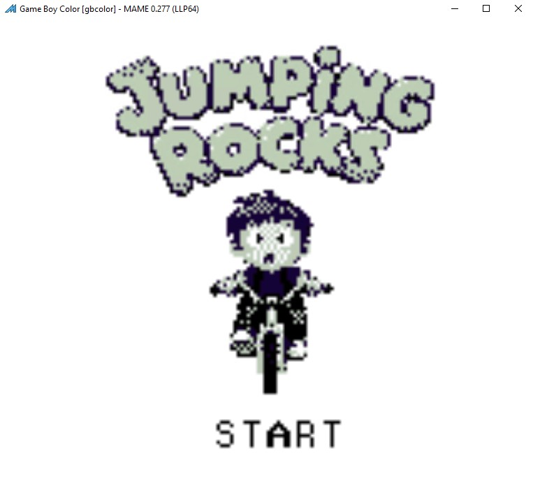
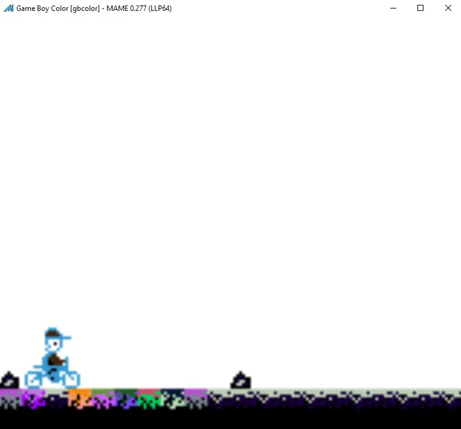
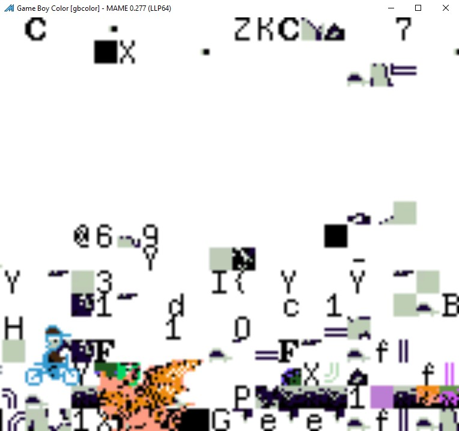
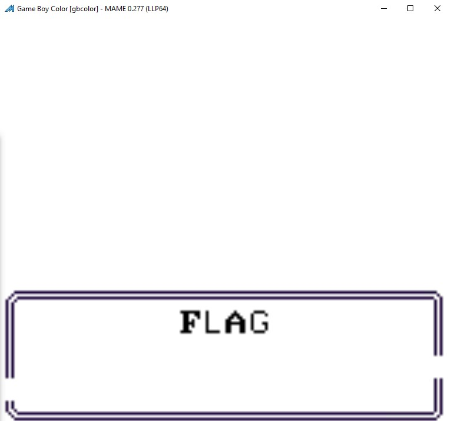
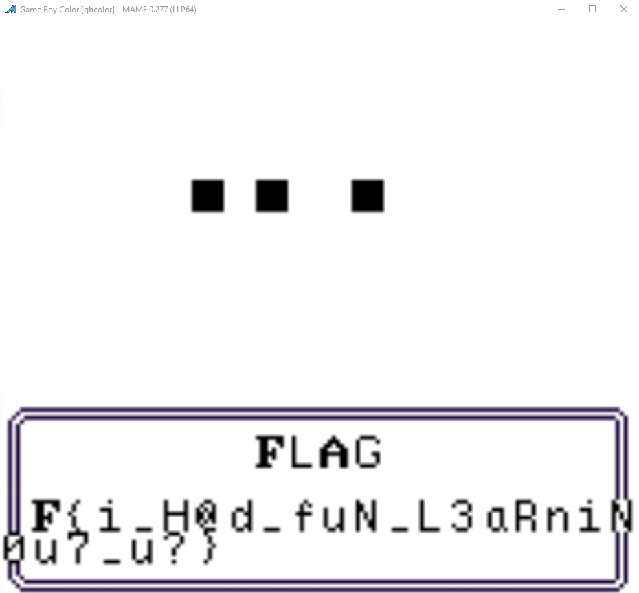

# CGB

ℹ️ Part of this analysis is done post CTF.

*CGB* was one of the reversing challenges from Google CTF 2025. It was solved by 23 teams and during the CTF I did mange to get part of the solution but not the final flag. After the CTF, with a bit more time, I attempted to solve it, and here's a writeup.

The task description reads:

> A game I found in a developer's drawer, it looks like an unfinished game about a character jumping rocks?  

and we are given an attachment that contains the following files

```
├── README.md
├── hash
│   └── gbcolor.xml
└── roms
    ├── gbcolor
    │   ├── gbc_boot.1
    │   └── gbc_boot.2
    └── gctf
        └── gctf.gb
```

Checking the `README.md`, we can see extra information about how we can run the game.


> I don't have a console with me, but you can emulate it with [MAME](https://www.mamedev.org/):  
>  
> ```sh  
> $ /usr/games/mame -hashpath hash -window -rp roms gbcolor gctf  
>  ```

Let's boot up the game and see what it's about.

When starting the game we can see a main screen


and after pressing start we can start it



but after a while, the game stops and displays garbage on screen.



From the MAME documentation, we find that adding `-debug` to the command line we can run it with a debugger. That will be handy for sure.

Let's see what's inside it using Ghidra.

## Static analysis

Ghidra by default is not able to load `gctf.gb` file but we can install an extension [GhidraBoy](https://github.com/Gekkio/GhidraBoy). With that, it's still recognized as Raw bytes, but we can pick a Sharp SM83 CPU as language which is what we need for this ROM. That's the one that's used in Game Boy Color.

The file is loaded but not much analysis is performed and no memory maps are automatically created. We can overcome that consulting with the specification - I've used [gbdev.io](https://gbdev.io/). We can find there info that, in case of a ROM, the start address is at address 0x150 - we can navigate there and press `d` to convert bytes to code.

As for the memory maps, the documentation also helps here and we can quickly create a couple more regions

```
ram	0000	  0x7fff	0x8000
video_bank	0x8000	0x9ffe
work_ram	  0xc000	0xcffe
work_ram2	  0xd000	0xdffe
OAM	        0xfe00	0xfe9e
io_controls	0xff00	0xff7e
```

Thanks to that, we won't be dealing with errors that some references are not defined. Also thanks to the documentation we can give specific locations more meaningful names. Instead of `0xff40`, we can use `LCD_Control`, and `0xff41` is `LCD_Status`.

The code that starts at `0x150` is basically the main loop of the game.

Having more meaningful names is helpful as we can identify functions where some input is accessed. Such function is one at 0x228 (`check_for_key`). It reads the joypad input (`0xff00`) twice, first selecting the d-pad to be read
```
  0234 3e 20           LD           A,0x20                  ; select d-pad
  0236 77              LD           (HL=>joypad_input),A
  0237 7e              LD           A,(HL=>joypad_input)
  0238 2f              CPL
  0239 e6 0f           AND          0xf
  023b cb 27           SLA          A
  023d cb 27           SLA          A
  023f cb 27           SLA          A
  0241 cb 27           SLA          A
  0243 47              LD           B,A
```
and then shifting the 4 lower bits to be the top 4, and then reading the buttons
```
  0244 3e 10           LD           A,0x10                  ; select buttons
  0246 77              LD           (HL=>joypad_input),A
  0247 7e              LD           A,(HL=>joypad_input)
  0248 2f              CPL
  0249 e6 0f           AND          0xf
  024b b0              OR           B
```
and OR-ing them together.
So after those operations the `A` register will hold:

| A-value | key pressed |
|---------|-------------|
| 0x80    | Down        |
| 0x40    | Up          |
| 0x20    | Left        |
| 0x10    | Right       |
| 0x08    | Start       |
| 0x04    | Select      |
| 0x02    | B           |
| 0x01    | A           |

And if we follow the logic at the end of this function, it seems to be storing the inputs in the buffer located at `0xc001` and `0xc051`. When new input is detected, the old buffer is shifted to make room, and the new key is placed at the end. Also the last key is available as a value at memory `0xc000`.
 
This function is called from 3 places: `0x1c0`, `0x1e2` and `0x220`.

The first two are directly in the `main_loop`. The first instance is to wait for a start key on the main screen - which is obvious having the current knowledge of the program:

```
wait_for_game_start:
          01c0 cd 28 02        CALL         check_for_key
          01c3 fa 00 c0        LD           A,(input_key)
          01c6 fe 08           CP           KEY_START       ; 0x08
          01c8 20 f6           JR           NZ,wait_for_game_start
```

The second one is at `0x1e2` and just after that there's a function `0x5b9` where the input at `0xc001` is compared with the following values `[0x01, 0x02, 0x10, 0x20, 0x10, 0x20, 0x80, 0x80, 0x40, 0x40]` and if we map it to the keys we get `[A, B, Right, Left, Right, Left, Down, Down, Up, Up]` which is [Konami code](https://en.wikipedia.org/wiki/Konami_Code) in reverse. 

If we try that during the game we are presented with the next screen.



Some progress, but the flag is not there yet.

The full function in question:

```
undefined check_konami_code()
    05b9 f5              PUSH         AF
    05ba c5              PUSH         BC
    05bb d5              PUSH         DE
    05bc e5              PUSH         HL
    05bd 21 40 4d        LD           pKonami,konami_keys
    05c0 11 01 c0        LD           pInput,input
    05c3 0e 0a           LD           C,0xa
    05c5 1a              LD           A,(pInput=>input)
    05c6 be              CP           (pKonami=>konami_keys)
    05c7 20 0d           JR           NZ,no_konami_code
    05c9 23              INC          pKonami
    05ca 13              INC          pInput
    05cb 0d              DEC          C
    05cc 20 f7           JR           NZ,keep_checking
    05ce e1              POP          pKonami
    05cf d1              POP          pInput
    05d0 c1              POP          BC
    05d1 f1              POP          AF
    05d2 e1              POP          pKonami
    05d3 c3 1d 02        JP           konami_code_accepted                  
```

So we should continue `konami_code_accepted` at address `0x21d`.

The function at `0x21d` is quite simple

```
undefined konami_code_accepted()
    021d cd a5 02        CALL         show_flag_screen_after_konami                                         
LAB_0220:
    0220 cd 28 02        CALL         check_for_key
    0223 cd 5d 03        CALL         FUN_035d
    0226 18 f8           JR           LAB_0220                
```

We need to check the function located at `0x35d`. That one is also not very interesting, but the function it calls located at 0x369 is.

```
undefined FUN_0369()
    0369 f5              PUSH         AF
    036a c5              PUSH         BC
    036b d5              PUSH         DE
    036c e5              PUSH         HL
    036d cd d3 02        CALL         FUN_02d3
    0370 cd 70 04        CALL         FUN_0470
    0373 cd fc 02        CALL         FUN_02fc
    ...
```

If we check those three functions, their functionality is as follows:

Starting from the top:
- copy our input buffer from `0xc052` to `0xc029` and transform it
- copy the transform data from `0xc052` to `0x99e1`
- compare the transformed data from `0xc029` with a predefined buffer located at `0x52b7`

We can start from the bottom.

The compare function is quite straightforward:

```
undefined FUN_02fc()
    02fc f5              PUSH         AF
    02fd c5              PUSH         BC
    02fe d5              PUSH         DE
    02ff e5              PUSH         HL
    0300 21 29 c0        LD           HL,prepared_data_c029
    0303 11 b7 52        LD           DE,final_data
    0306 0e 28           LD           C,0x28
LAB_0308
    0308 1a              LD           A,(DE=>final_data)
    0309 47              LD           B,A
    030a 2a              LD           A,(HL+)=>prepared_data_c029
    030b b8              CP           B
    030c 20 18           JR           NZ,data_do_not_match
    030e 13              INC          DE
    030f 0d              DEC          cnt
    0310 20 f6           JR           NZ,LAB_0308
```

The `final_data` is:

```
0x1c, 0x17, 0xc7, 0x11, 0xc0, 0xc6, 0xc5, 0x85, 0xa3, 0x57, 0x9d, 0xf1, 0xb2, 0xae, 0x01, 0x51, 
0xe0, 0xf5, 0x18, 0xb1, 0xaf, 0x7f, 0x13, 0x32, 0x39, 0xeb, 0xe6, 0x26, 0x96, 0x26, 0x8b, 0xaa,
0x1f, 0x23, 0x00, 0x37, 0x86, 0x7a, 0x8d, 0xbc
```

and if all the bytes matches we do execute some more functions but for now we need to find out what would give us those final bytes.

The middle function seems to be responsible for displaying our input to the screen so it will probably show the flag instead of the empty space we saw previously.

```
undefined FUN_0470()
  0470 f5              PUSH         AF
  0471 c5              PUSH         BC
  0472 d5              PUSH         DE
  0473 e5              PUSH         HL
  0474 21 e1 99        LD           HL,DAT_99e1
  0477 11 52 c0        LD           DE,DAT_c052
  047a 0e 28           LD           C,0x28
LAB_047c
  047c 1a              LD           A,(DE=>DAT_c052)
  047d cd 30 00        CALL         VRAM_accessible
  0480 22              LD           (HL+),A
  0481 13              INC          DE
  0482 0d              DEC          C
  0483 20 f7           JR           NZ,LAB_047c
  0485 e1              POP          HL
  0486 d1              POP          DE
  0487 c1              POP          BC
  0488 f1              POP          AF
  0489 c9              RET
```

so that leaves us "only" with the first one. We need to understand how we get the correct bytes into our buffer so that later they are displayed on the screen by the `FUN_0470` routine and compared with the final ones inside `FUN_02fc`.

## Function FUN_02d3

This one is the most complex one from all of those before so it is justified to give it a separate chapter.

The function starts with yet another data copy, and then we call another function on our buffer.

```
    02e3 21 29 c0        LD           HL,prepared_data_c029
    02e6 11 7d c0        LD           DE,DAT_c07d
    02e9 0e 00           LD           C,0x0
LAB_02eb:                 
    02eb cd 27 53        CALL         decode_flag
    02ee 23              INC          HL
    02ef 23              INC          HL
    02f0 0c              INC          C
    02f1 0c              INC          C
    02f2 79              LD           A,C
    02f3 fe 28           CP           0x28
    02f5 20 f4           JR           NZ,LAB_02eb
```

We operate on 2 bytes and call the `decode_flag` function until we reach `0x28`. So what's going on inside `decode_flag`?
This part isn't entirely clear to me, but it seems that we are loading some color values. First part of the function populates `0x99e1` with the values `07 01 00 05 04 03 06 02 07 00 01 05 03 04 02 06 00 07 05 01 03 04 06 02 07 00 05 01 03 04 02 06 07 00 01 05` (those are defined in `gbc_boot.2`) which seem to be palette numbers. Each number is shifted by 3 and used to load four color values associated with that palette.

```
    5349 cd 30 00        CALL         VRAM_accessible
    534c fa 69 ff        LD           A,(BCPD_BGPD)
    534f 12              LD           (DE),A
    5350 13              INC          DE
    5351 34              INC          (HL)
    5352 0d              DEC          C
    5353 20 f4           JR           NZ,load_4b
```

later we do the same but we pick next number from the list and we xor those values together. For example for the pair `(7,1)` we would get the following:

```
 0x13 0x78 0xF7 0x69 (7)
 0x7F 0x42 0x3D 0x0A (1)
```

and XOR-ing them together produces `0x6C 0x3A 0xCA 0x63`.

This was only a preparation. Now the real work begins. Near the end of this function
```
  5384 cd ef 52        CALL         FUN_52ef
  5387 cd 00 53        CALL         FUN_5300
  538a 0c              INC          C
  538b 79              LD           A,C
  538c fe 10           CP           0x10
  538e 20 f4           JR           NZ,LAB_5384
  5390 c1              POP          BC
  5391 f1              POP          AF
  5392 c9              RET
```

first we load the xored color value from the index stored in register C. We take it modulo 4.

Next, we do some byte and bit manipulation:

For each pair of input bytes (call them `A`, `B`), we perform the following 16 times:
- we take the B and do the `RLCA` and `RRCA` based on the bits of the xored color value
- we xor the output of that with `A` and store it in a `temp` variable
- we store B as a new A
- for the new B we put the calculated temp variable

In Python, we could write it as:

```python
def shuffle_bits(A, B):
    B &= 0xFF
    C = 8
    while C > 0:
        if B & 0x01:
            A = ((A << 1) | (A >> 7)) & 0xFF
        else:
            A = ((A >> 1) | (A << 7)) & 0xFF
        B >>= 1
        C -= 1
    return A
    
def decode(ab, v):
    ab_prim = list(ab)
    for i in range(16):
        b = v[i % 4]
        a = ab_prim[1]
        a = shuffle_bits(a, b)
        tmp = ab_prim[0] ^ a
        ab_prim[0] = ab_prim[1]
        ab_prim[1] = tmp
    return ab_prim
```

and we store those shuffled values as our new input. We repeat this process until all bytes are processed. And that's the input that is compared with our predefined buffer at `0x52b7`.

Finding the input is trivial now. We can check all the possible 2 byte pairs and see which one, after shuffling will give us the correct values.

```python
idx = [
    0x07, 0x01, 0x00, 0x05, 0x04, 0x03, 0x06, 0x02, 0x07, 0x00, 0x01, 0x05, 0x03, 0x04, 0x02, 0x06,
    0x00, 0x07, 0x05, 0x01, 0x03, 0x04, 0x06, 0x02, 0x07, 0x00, 0x05, 0x01, 0x03, 0x04, 0x02, 0x06,
    0x07, 0x00, 0x01, 0x05, 0x03, 0x04, 0x02, 0x06
]

def check_bits(A, B):
    B &= 0xFF
    C = 8
    while C > 0:
        if B & 0x01:
            A = ((A << 1) | (A >> 7)) & 0xFF
        else:
            A = ((A >> 1) | (A << 7)) & 0xFF
        B >>= 1
        C -= 1
    return A
      
def decode(ab, v):
    ab_prim = list(ab)
    for i in range(16):
        b = v[i % 4]
        a = ab_prim[1]
        a = check_bits(a, b)
        tmp = ab_prim[0] ^ a
        ab_prim[0] = ab_prim[1]
        ab_prim[1] = tmp
    return ab_prim

vals = {
    0: [0x03, 0x1c, 0x37, 0x5B],
    1: [0x7f, 0x42, 0x3d, 0x0a],
    2: [0x76, 0x5b, 0x61, 0x1c],
    3: [0x2e, 0x79, 0x64, 0x11],
    4: [0x40, 0x33, 0x58, 0x35],
    5: [0x7a, 0x7D, 0x4c, 0x22],
    6: [0x0f, 0x4a, 0x56, 0x65],
    7: [0x13, 0x78, 0xf7, 0x69]}

keys = []    
    
for k in range(0, len(idx), 2):
    i = idx[k]
    j = idx[k+1]
    v1 = vals[i]
    v2 = vals[j]
    keys.append([(c1 ^ c2) for (c1,c2) in zip(v1,v2)]) 

final = [
    0x1c, 0x17, 0xc7, 0x11, 0xc0, 0xc6, 0xc5, 0x85, 0xa3, 0x57, 0x9d, 0xf1, 0xb2, 0xae, 0x01, 0x51, 
    0xe0, 0xf5, 0x18, 0xb1, 0xaf, 0x7f, 0x13, 0x32, 0x39, 0xeb, 0xe6, 0x26, 0x96, 0x26, 0x8b, 0xaa,
    0x1f, 0x23, 0x00, 0x37, 0x86, 0x7a, 0x8d, 0xbc ]

def search(part_flag, key):
    for k in range(255):
        for l in range(255):
            candidate = [k,l]
            res = decode(candidate, key)
            if res == part_flag:
                return candidate
    return None

f = []
for i in range(len(final)//2):
    part_flag = final[i*2:i*2+2]
    key = keys[i]
    c,d = search(part_flag, key)
    f.append(c)
    f.append(d)

print(f'Res? {[hex(x) for x in f[::-1]]}')
        
l = []
for i in range(len(f)//2):
    part_flag = f[i*2:i*2+2]
    key = keys[i]
    a,b = decode(part_flag, key)
    l.append(a)
    l.append(b)
    
print(f'Correct? {all([a == b for (a,b) in zip(l,final)])}')
```

What it does it to first calculate all the color XOR values and store them inside keys. And then later find an initial value of bytes that when shuffled produce the expected result.

Running the script will give us the correct values `['0x4b', '0x4c', '0x37', '0x48', '0x44', '0x37', '0x3d', '0x0a', '0x47', '0x48', '0x39', '0x3d', '0x2a', '0x48', '0x0a', '0x0f', '0x25', '0x48', '0xf', '0x16', '0x2b', '0x30', '0x1a', '0x23', '0x40', '0x14', '0x48', '0x16', '0x37', '0x28', '0x48', '0x26', '0x47', '0x10', '0x48', '0x2b', '0x4a', '0x0e', '0x1c', '0x0b']`.

But we're still missing one piece: how do we input it, and where?

If we go back to the function that read the joypad input (`0x228`) if we detect that there was an input we call a few function and one of them is at `0x457`. It's not very lengthy, but it reads a value from `0xc07a`.

```
undefined store_key()
    0457 f5              PUSH         AF
    0458 c5              PUSH         BC
    0459 d5              PUSH         DE
    045a e5              PUSH         HL
    045b 21 7b c0        LD           HL,cnt_00_ff
    045e 4e              LD           C,(HL=>cnt_00_ff)
    045f cb 21           SLA          C
    0461 fa 00 c0        LD           A,(input_key)
    0464 3d              DEC          A
    0465 46              LD           B,(HL=>cnt_00_ff)
    0466 a0              AND          B
    0467 b1              OR           C
    0468 ea 51 c0        LD           (DAT_c051),A
    046b e1              POP          HL
    046c d1              POP          DE
    046d c1              POP          BC
    046e f1              POP          AF
    046f c9              RET
```

That value goes from `0x00` to `0xFF`, and the current value is shifted left by 1 and OR-ed with the provided key. The computed value is what's used in the subsequent calculations.

Now, I'm not sure if it's possible to reliably input the correct values from within the game (since we don't see the counter), but we can fake it. If we put a breakpoint at `0x468` we can set `A` to the correct value from our python script and it should be good.

Note: I did try to automate that part but it seems MAME isn't quite there yet in that regard so there's a bit of manual work required.

We can use `bpset 0x468`, press a key and then do `A=<value from Python output>`, and the flag should begin to appear.



Final flag: `CTF{i_H@d_fuN_L3aRniNG_cGB_h0w_@B0u7_u?}`

Challenge solved — and I definitely learned a lot about Game Boy Color internals along the way.