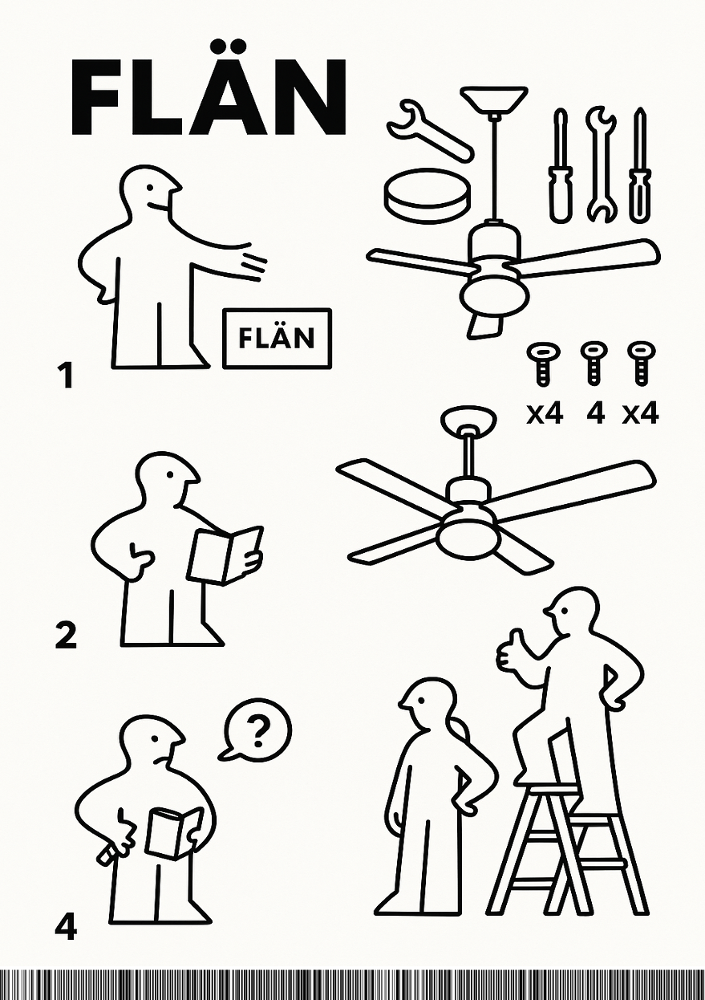
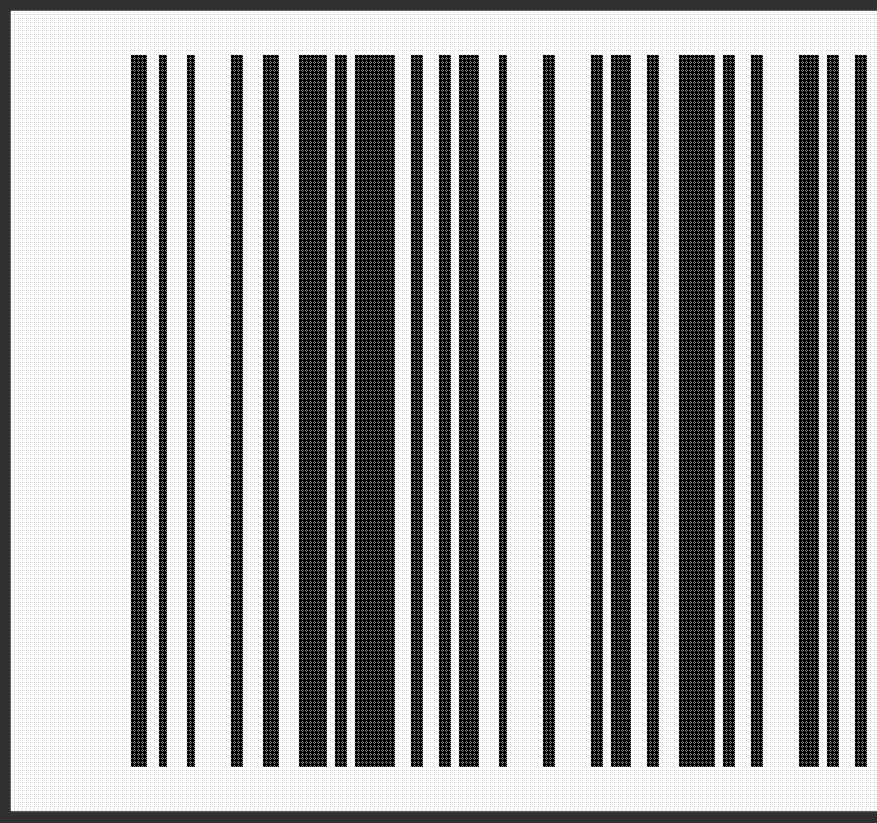

# Instructions unclear #

"Instructions unclear" was one of the reversing challenges from Hack.Lu CTF 2025. The description reads:

> bro is stuck installing this FLÄN ceiling fan. Instructions are unclear. Can you help 'em?

And we were given an attachment that is a single PDF file. It appears to be an instruction for a fan but at the bottom of it we can spot some black and white strips that look like a bar code.



To peek into PDFs we can use [pdftool.py](https://github.com/DidierStevens/DidierStevensSuite/blob/master/pdftool.py) a tool by Didier Stevens.

We can list all the sections that PDF consists of.

> `pdftool.py instructions.pdf`

```
PDF Comment '%PDF-1.6\n'

PDF Comment '%\xe2\xe3\xcf\xd3\n'

...

obj 6 0
 Type: /XObject
 Referencing: 7 0 R
 Contains stream

  <<
    /Type /XObject
    /Subtype /Image
    /Filter /FlateDecode
    /BitsPerComponent 8
    /Width 1024
    /Height 1536
    /ColorSpace /DeviceRGB
    /DecodeParms 7 0 R
    /Length 1986050
  >>

...


obj 8 0
 Type: /XObject
 Referencing:
 Contains stream

  <<
    /BitsPerComponent 8
    /ColorSpace /DeviceRGB
    /Filter [ /ASCII85Decode /FlateDecode ]
    /Height 200
    /Subtype /Image
    /Type /XObject
    /Width 440471
    /Length 10863939
  >>

...

PDF Comment '%%EOF\n'
```

Apart from the standard stuff, we can spot 2 images at index 6 and 8. Especially the one at index 8 can catches attention, as it's only 200 in height but 440471 in width. Its size is also over 10 MB.

We can extract the stream in its raw form using the tool:

> `pdftool.py -o 8 -d stream8.bin .\instructions.pdf`

`pdftool.py` also has an option to process the filters that should be applied to this image, but for some reason this option didn't work with this one.

```python
import base64, zlib, sys, re
from base64 import a85decode

raw = open("stream8.bin","rb").read()


raw = raw.strip().replace(b'<~', b'').replace(b'~>', b'')
if not raw.startswith(b'<~'):
    raw = b'<~' + raw
if not raw.rstrip().endswith(b'~>'):
    raw = raw.rstrip() + b'~>'
ascii85_decoded = a85decode(raw, adobe=True)
data = zlib.decompress(ascii85_decoded)
open("stream8_decoded.raw","wb").write(data)
```

But that will give us only the raw image data, without any headers or metadata, but we can turn those pixels into a proper file.

```python
from PIL import Image
img = Image.frombytes("RGB", (width, height), bytes(data))
img.save("stream8_decoded.png")
```

Having this file we can confirm that it's quite long barcode. No barcode decoding tool wanted to work with this one (I tried pyzxing and others) so I've decided to go with getting the data myself.

We can get the pixels quite easily using Pillow.

```python
from PIL import Image

img = Image.open("stream8_decoded.png")
width, height = img.size
row_to_read = 20

bitstream = ''
for x in range(width):
    pixel = img.getpixel((x, row_to_read))
    (r,g,b) = pixel
    bitstream += '1' if r == 0 else '0'
print(bitstream)
```

But it's not over with processing the stream data. In barcodes (or at least in this particular type), the width of bars is a multiple of a basic "module" width.

It appears that the minimum is 2 pixels wide, but it's not always a clear multiple. We can see that some of the wider black bars have only 3 pixels instead of 4 as they're supposed to.



For now I've decided to just divide by 2 and deal with that later if needed. So with that, we have our stream of bytes that builds the barcode, but how do we decode it?

First we would need to find which type of bar code it is and [there are a couple](https://en.wikipedia.org/wiki/Barcode#Linear_barcodes) of those in fact.

Checking the wiki page, the most suitable one seems to be [Code 128](https://en.wikipedia.org/wiki/Code_128).

## Decoding Code 128

To get to the data encoded in this barcode, we need to focus on the start symbol, as there are a couple of those, and depending on which one it is, we decode the data differently.

| Start Symbol | Data                  |
|--------------|-----------------------|
| Start A      | data in range 00 - 95 |
| Start B      | data + 32             |
| Start C      | 2 digits 00 - 99      |

But the data is not coded as just the ones or zeros. It's coded as a runs. So for example if our bit pattern is
`11010010000` our runs would be `(2,1,1,2,1,4)` which encoded Start B symbol exactly. It looks like this might work — we just need to implement it.


```python
def bit_runs(bitstring: str):
    if not bitstring:
        return []

    runs = []
    original = []
    current_bit = bitstring[0]
    count = 1

    for b in bitstring[1:]:
        if b == current_bit:
            count += 1
        else:
            v = count
            v //= 2
            if v > 4:
                v = 4
            runs.append(v)
            original.append(count)
            current_bit = b
            count = 1
    v = count
    v //= 2
    if v > 4:
       v = 4
    runs.append(v)
    original.append(count)
    return runs, original
```
There can be at most 4-unit-wide bars, so we cap at that number. If we find a 10 or more pixel-wide bar, we consider it wrong and limit it to 4.

The original, non-divided values were returned to ease debugging at a later stage when there are issues.

Having those runs we can decode them into letters.

We need the code table:

```python
CODE128_PATTERNS = {
    0:[2,1,2,2,2,2], 1:[2,2,2,1,2,2], 2:[2,2,2,2,2,1], 3:[1,2,1,2,2,3],
    4:[1,2,1,3,2,2], 5:[1,3,1,2,2,2], 6:[1,2,2,2,1,3], 7:[1,2,2,3,1,2],
    8:[1,3,2,2,1,2], 9:[2,2,1,2,1,3], 10:[2,2,1,3,1,2], 11:[2,3,1,2,1,2],
    12:[1,1,2,2,3,2], 13:[1,2,2,1,3,2], 14:[1,2,2,2,3,1], 15:[1,1,3,2,2,2],
    16:[1,2,3,1,2,2], 17:[1,2,3,2,2,1], 18:[2,2,3,2,1,1], 19:[2,2,1,1,3,2],
    20:[2,2,1,2,3,1], 21:[2,1,3,2,1,2], 22:[2,2,3,1,1,2], 23:[3,1,2,1,3,1],
    24:[3,1,1,2,2,2], 25:[3,2,1,1,2,2], 26:[3,2,1,2,2,1], 27:[3,1,2,2,1,2],
    28:[3,2,2,1,1,2], 29:[3,2,2,2,1,1], 30:[2,1,2,1,2,3], 31:[2,1,2,3,2,1],
    32:[2,3,2,1,2,1], 33:[1,1,1,3,2,3], 34:[1,3,1,1,2,3], 35:[1,3,1,3,2,1],
    36:[1,1,2,3,1,3], 37:[1,3,2,1,1,3], 38:[1,3,2,3,1,1], 39:[2,1,1,3,1,3],
    40:[2,3,1,1,1,3], 41:[2,3,1,3,1,1], 42:[1,1,2,1,3,3], 43:[1,1,2,3,3,1],
    44:[1,3,2,1,3,1], 45:[1,1,3,1,2,3], 46:[1,1,3,3,2,1], 47:[1,3,3,1,2,1],
    48:[3,1,3,1,2,1], 49:[2,1,1,3,3,1], 50:[2,3,1,1,3,1], 51:[2,1,3,1,1,3],
    52:[2,1,3,3,1,1], 53:[2,1,3,1,3,1], 54:[3,1,1,1,2,3], 55:[3,1,1,3,2,1],
    56:[3,3,1,1,2,1], 57:[3,1,2,1,1,3], 58:[3,1,2,3,1,1], 59:[3,3,2,1,1,1],
    60:[3,1,4,1,1,1], 61:[2,2,1,4,1,1], 62:[4,3,1,1,1,1], 63:[1,1,1,2,2,4],
    64:[1,1,1,4,2,2], 65:[1,2,1,1,2,4], 66:[1,2,1,4,2,1], 67:[1,4,1,1,2,2],
    68:[1,4,1,2,2,1], 69:[1,1,2,2,1,4], 70:[1,1,2,4,1,2], 71:[1,2,2,1,1,4],
    72:[1,2,2,4,1,1], 73:[1,4,2,1,1,2], 74:[1,4,2,2,1,1], 75:[2,4,1,2,1,1],
    76:[2,2,1,1,1,4], 77:[4,1,3,1,1,1], 78:[2,4,1,1,1,2], 79:[1,3,4,1,1,1],
    80:[1,1,1,2,4,2], 81:[1,2,1,1,4,2], 82:[1,2,1,2,4,1], 83:[1,1,4,2,1,2],
    84:[1,2,4,1,1,2], 85:[1,2,4,2,1,1], 86:[4,1,1,2,1,2], 87:[4,2,1,1,1,2],
    88:[4,2,1,2,1,1], 89:[2,1,2,1,4,1], 90:[2,1,4,1,2,1], 91:[4,1,2,1,2,1],
    92:[1,1,1,1,4,3], 93:[1,1,1,3,4,1], 94:[1,3,1,1,4,1], 95:[1,1,4,1,1,3],
    96:[1,1,4,3,1,1], 97:[4,1,1,1,1,3], 98:[4,1,1,3,1,1], 99:[1,1,3,1,4,1],
    100:[1,1,4,1,3,1], 101:[3,1,1,1,4,1], 102:[4,1,1,1,3,1],
    103:[2,1,1,4,1,2], 104:[2,1,1,2,1,4], 105:[2,1,1,2,3,2],
    106:[2,3,3,1,1,1,2]
}
```

And with that we start decoding the data
```python
def decode_run_lengths(widths, originals):
    i = 0
    decoded = []
    code_set = None

    while i + 5 < len(widths):
        pattern = widths[i:i+6]
        original_pattern = originals[i:i+6]

        code = next((k for k, v in CODE128_PATTERNS.items() if v == pattern), None)
        if code is None:
            print(f'Did not find matching code!!! {pattern=} {original_pattern=} {i=}')
            i += 1
            continue

        if code in (99, 100, 101, 103, 104, 105):
            code_set = {99: 'C', 100: 'B', 101: 'A', 103: 'A', 104: 'B', 105: 'C'}[code]
            i += 6
            continue

        if code == 106:
            i += 6
            continue

        ch = symbol_to_char(code, code_set)
        if ch is not None:
            decoded.append(ch)
        i += 6

    return ''.join(decoded)
```

And we get some data...

```
.section .ikea
FLEN␦db -
paX:    db 23
BLKSZ␦db 12jb0ts: db 47
c5d: db 225,w4,82,29,67,214,139,164,154,116,12,47,628445,3,47,104,35,84,93,n=4,6,25,163,30,206,78,117,5,22x233,2i152,55,146,238,h,49,dn173,199,34,15,78,84,81,161,6,22,16171824121816171220221218231217191220171217251712221217181912212412242512171725122225
kallax db 3,,020,0,4,0,0,0,0,0,0,0,0,0,0,0,0,0,0,0,0,0,0,0,5,0,0,1,0,
...
```

It looks like we’re onto something, but not quite yet. There are some clear indications that we are getting something meaningful (`.section`, `.ikea`) but there's also some non-printable characters where there should be something readably printable.

We can also spot many messages indicating that we did not manage to decode certain symbols.

> Did not find matching code!!! pattern=[2, 2, 4, 1, 1, 2] original_pattern=[5, 4, 8, 2, 2, 5] i=180

Checking the code table shows that there is no code like this, but there's a code that's quite close - `[2, 2, 3, 1, 1, 2]`.

At first I wanted to fix those per position, but there were too many so I've decided to code a change in the parsing code so that if we get 8 pixel wide bar, we would code it as 3 instead of 4 as it would suggest doing simple math.

The other change that needed to be made was to override decoding of code 10 in mode A. To make the code printable, it had to be decoded in mode B.


Adding such a small change in the `bit_runs` method solved all the issues.

```python
if count == 8:
    v -= 1
```

and another one in `decode_run_lengths`
```python
if code_set == 'A' and ch != '\n':
    print(f'Resetting to b for {code=}')
    code_set = 'B'
    continue
```

And what we get is not yet the flag, but [assembly code](https://gist.github.com/pawlos/52c423b81c97abb8271edefab7ee74a1).

## Assembly reversing

The variable names stick to the theme, so it's funny to see `billy` or `kallax` holding some interesting values. 

The `c5d` blob appears to be the encrypted reference flag stored in the binary. The code reads user input, runs it through the same two-round routine, and compares the result byte-for-byte to `c5d` (lines [420-428](https://gist.github.com/pawlos/52c423b81c97abb8271edefab7ee74a1#file-code-asm-L420-L428)). If the comparison succeeds the PASS variable flips to 1; this is the exact check the CTF uses to validate the flag.

The algorithm shows similarities to RC4, but it performs two separate rounds. Apart from that, there's a static S-box and bit-shifting.

Despite the ad-hoc mixing, the algorithm is reversible because all its core operations are reversible at the byte level (indexed swaps, XORs, and bit rotations). That means we can either invert the steps directly or reconstruct the keystream by emulating the forward routine and searching for the key/initial state.

We just need to understand it fully, in all the details. Since it was almost 4 AM at this point, we asked an AI to reverse it for us.

It does, with a bit of struggle, but in the end manages to [produce code](https://gist.github.com/pawlos/1653eaecf2d720cf4258dd3835c75b1d) that yields a valid flag.

## Summary

"Instructions unclear" indeed - from a PDF and a custom barcode that fooled standard readers, to assembly and a two‑round cipher: do all that and you’ll get the flag.