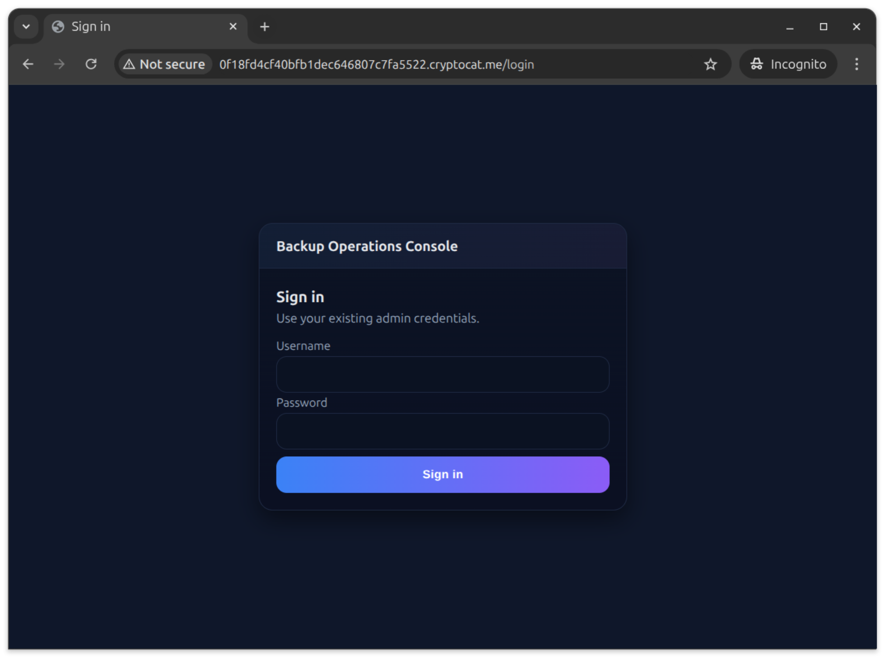
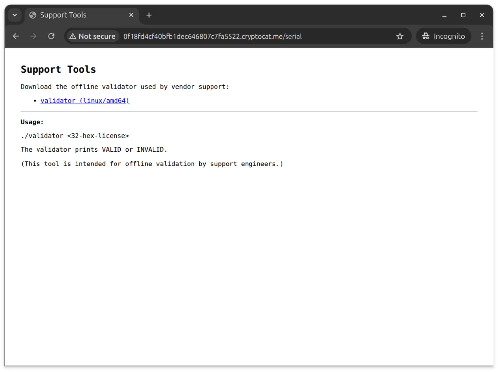

> New CTF challenge! It will run until the 30th of October ⏳
>
> There's no prizes, but the first 3 solves will earn themselves the "Hacker Cat" rank in discord.
>
> You can use the this channel to discuss, but no hints/spoilers until the challenge finishes, please!
>
> DM me if you get the flag or have questions (no hints!) 🙂
> Download "Ultimate Calculator 3000" to get started 👇

## ultimate_calc binary

The binary starts by printing the calculator menu and awaits the user input. The option 2 - `Check serial (Professional feature)` looks interesting. But if we run it we are presented with `Sorry! This feature is still under construction.`. Start by loading the file into Ghidra.

The code responsible for this option is the following:

```c
if (choice == '2') {
  puts("\x1b[33m\nSorry! This feature is still under construction.\x1b[0m");
  FUN_101500();
  break;
}
```

This code immediately prints a message and returns; the serial-check logic is elsewhere. Checking some other methods in this binary we can spot a different function that looks interesting - `FUN_1019a0`. We can spot strings like `Serial must be 32 hex characters.`, `Invalid serial` or `flag` so this looks like our target.

The function starts by decoding two byte arrays: `DAT_102540` and `DAT_102580`. We can decode them with the following short python code:

```python
def decode(start, data):
  b = []
  for c in data:
    start = (start * 0x41c64e6d + 0x3039) & 0x7fffffff
    b.append(c ^ (start >> 0x10) & 0xFF)
  return ''.join([chr(c) for c in b])

s = 0xbeef
DAT_102540 = [0x30, 0x30, 0x01, 0xb4, 0xe0, 0x0f, 0x3c, 0xe2, 0x99, 0xe4, 0x28, 0x59, 0x52, 0xa2, 0x90, 0xe6, 0x7e, 0x7a, 0x49, 0x10, 0x54, 0xf5, 0xfd, 0x1c, 0xa4, 0x8d, 0xf8, 0xc2, 0x22, 0x6e, 0x2e, 0x0b, 0x33, 0xd7, 0xcd, 0x03, 0x93, 0x5e, 0xc0, 0xb7, 0x1a, 0x94, 0x0a, 0x7b, 0x87, 0x4b, 0x6d, 0xe8, 0xfb, 0x89, 0xf5, 0xd8]
print(decode(s, DAT_102540))

s = 0x1337
DAT_102580 = [0x16, 0x63, 0x7c, 0x4b, 0xc8, 0x8f, 0x69, 0x62, 0x13, 0x95, 0x4c, 0x4b, 0x78, 0x75, 0x44, 0xb6, 0xca, 0xed, 0x02, 0x76, 0x0d, 0xa6, 0x99, 0x25, 0xa4, 0xa7, 0x7e, 0x8c, 0xb8, 0xf4, 0x34, 0xae, 0x1c, 0x52, 0x76, 0x23, 0x70, 0x6a, 0x8a, 0x87]
print(decode(s, DAT_102580))
```

The first one gives us the URL - `http://9cdfb439c7876e703e307864c9167a15.cryptocat.me` and the second one ` {"user":"cat","pass":"MeowSec159102374"}` - user and password payload.

The next two urls are constructed by concatenating the decoded URL with paths - `/auth` and `/check`.

Next, a 32-hex-character serial is being requested from the user and stored for later.

After that, a curl request to `/auth` endpoint with the user and password payload.

Doing that via `curl` gives us a token:

> curl -H "Content-type: application/json" -d '{"user": "cat", "pass": "MeowSec159102374"}' http://9cdfb439c7876e703e307864c9167a15.cryptocat.me/auth
>
> {"token":"c00203c53bb1284ff698a541555a3232731dfdd8"}

This token later is used to be set as a Bearer token for the request to the `/check` endpoint.

```c
snprintf(serial_payload,0x200,"{\"serial\":\"%s\"}",serial);
iVar5 = do_curl(check_endpoint,serial_payload,local_948,&local_b98);
```

We don't know the serial and there was nothing until this point that would give away how it is constructed. So we can try with a random one:

> curl --oauth2-bearer "c00203c53bb1284ff698a541555a3232731dfdd8" -H "Content-type: application/json" -d '{"serial": "12345678901234567890123456789012"}' http://9cdfb439c7876e703e307864c9167a15.cryptocat.me/check
> {"ok":false}

That doesn't give us much but if we include `-v` for the curl command we get an extra info in the response.

> Link: <http://0f18fd4cf40bfb1dec646807c7fa5522.cryptocat.me/serial>; rel="alternate"; title="backup"

Visiting this url we are redirected to `/login` screen.



We can use the credentials we've extracted earlier from the binary to log in.



There, there's only one thing to do. Download the support tool - validator, that can tell if a 32-hex-character serial number is valid.

## validator binary

This time it's a go binary with symbols. And among many methods we can spot `main.verifySerialHex` so we can start there.

First, the code decodes the 32-hex-character serial into 16 bytes using `encoding/hex.Decode`. Then, we constructed `crypto/hmac` object passing data located at `0x4a8111`. Here the disassembly is a bit misleading showing us that there are some `runtime.strequal` called but in fact it's `hmac.Write`.

The first thing that we write is the string `cat:MeowSec159102374:`. Next is the first 4 bytes from our serial. And at the end we call `hmac.Sum`.

Here's an equivalent python program:

```python
import hmac
key = [0x65, 0x36, 0x39, 0x64, 0x30, 0x63, 0x35, 0x31, 0x36, 0x65, 0x62, 0x38, 0x63, 0x61, 0x65, 0x32, 0x33, 0x66, 0x62, 0x62, 0x34, 0x30, 0x30, 0x32, 0x64, 0x66, 0x63, 0x34, 0x63, 0x33, 0x34, 0x33]

_hmac = hmac.new(bytes(key), digestmod="sha256")
_hmac.update(b'cat:MeowSec159102374:\x12\x34\x56\x78')
_hmac.hexdigest()
```

Later, there's a loop that checks the first 12 bytes of the hmac with the rest part of the serial.

```c
check_correctness:
00487ef2 0f b6 34 10     MOVZX      ESI,byte ptr [RAX + RDX*0x1]
00487ef6 0f b6 7c        MOVZX      EDI,byte ptr [RCX + RDX*0x1 + 0x4]
          11 04
00487efb 31 fe           XOR        ESI,EDI
00487efd 48 ff c2        INC        RDX
00487f00 09 f3           OR         EBX,ESI
00487f02 48 83 fa 0c     CMP        RDX,0xc
00487f06 7c ea           JL         check_correctness
```

And if they are equal the validator will return true as our serial is valid.
So for our start of serial `12345678`, the end should be `30a16273a8af4ecf304ad05c`.
Let's send that again to the `/check` endpoint.

> curl --oauth2-bearer "c00203c53bb1284ff698a541555a3232731dfdd8" -H "Content-type: application/json" -d '{"serial": "1234567830a16273a8af4ecf304ad05c"}' http://9cdfb439c7876e703e307864c9167a15.cryptocat.me/check

And that gives us the flag: `{"flag":"flag{4_bi7_0f_r3v_4_bi7_0f_w3b}","ok":true}`.