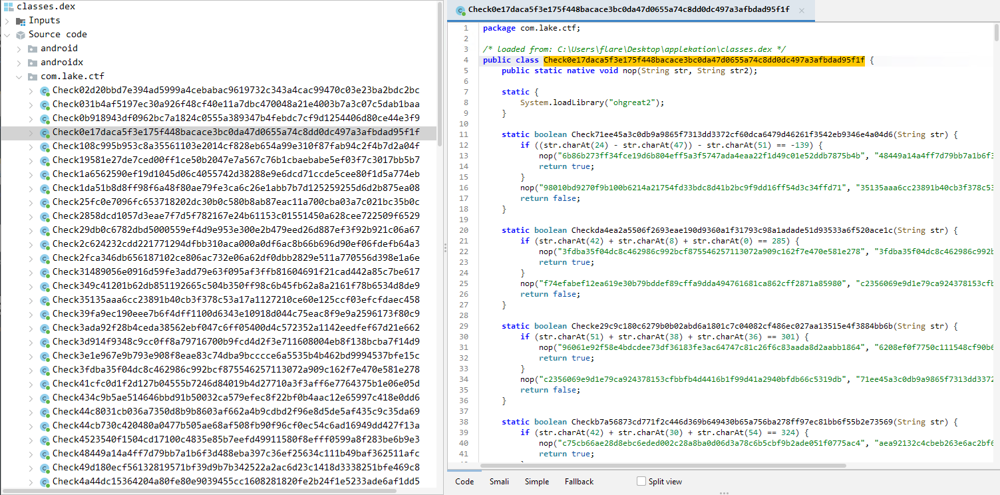

## Intro
`Another Android Applaketion` was one of the reversing challenges during Lake CTF 2025 Quals. It was a bit harder version of a challenge that was available during Lake CTF 2024 - `An Android Applaketion`.'

Same as the last time, we are given a single `.apk` file with the challenge.

Since it's an `apk` (which is essentially a renamed `zip` archive), we can start by unzipping it.

```
   2216 Jan  1  1981 AndroidManifest.xml
   4096 Nov 28 19:30 META-INF
2818080 Jan  1  1981 classes.dex
   4096 Nov 28 19:30 lib
   4096 Nov 28 19:30 res
 218312 Jan  1  1981 resources.arsc
```

To get the code, we need to peek inside `classes.dex`. To do that we can use, a Java decompiler. I've used jadx with its GUI.

A first glance at the decompiled classes and we can spot the similar pattern as last year. 



We have many, similar looking classes, that contain many, similarly looking methods. Each method validates a couple of characters in the flag input and if we combine calls to some of the methods, we can get an input that would be a valid flag. But how to know which ones are valid?

Furthermore, the function `nop` is currently unexplained. For now, the Java code (specifically in `m4lambda$onCreate$0$comlakectfMainActivity`) reveals that the flag is 55 characters long.

```java
void m4lambda$onCreate$0$comlakectfMainActivity(EditText editText, TextView textView, View view) {
    String string = editText.getText().toString();
    Log.i("LAKECTF", "flag: " + string);
    if (string.length() != 55) {
        textView.setText("flag is wrong...");
        return;
    }
    boolean zTest = Test(string);
    boolean zTest2 = Test(string);
    boolean zTest3 = Test(string);
    boolean zTest4 = Test(string);
    boolean zTest5 = Test(string);
    boolean zTest6 = Test(string);
    boolean zTest7 = Test(string);
    boolean zTest8 = Test(string);
    boolean zTest9 = Test(string);
    boolean zTest10 = Test(string);
    boolean zTest11 = Test(string);
    //...
    boolean zTest79 = Test(string);
    boolean zTest80 = Test(string);
    if (zTest && zTest2 && zTest3 && zTest4 && zTest5 && zTest6 && zTest7 && zTest8 && zTest9 && zTest10 && zTest11 && zTest12 && zTest13 && zTest14 && zTest15 && zTest16 && zTest17 && zTest18 && zTest19 && zTest20 && zTest21 && zTest22 && zTest23 && zTest24 && zTest25 && zTest26 && zTest27 && zTest28 && zTest29 && zTest30 && zTest31 && zTest32 && zTest33 && zTest34 && zTest35 && zTest36 && zTest37 && zTest38 && zTest39 && zTest40 && zTest41 && zTest42 && zTest43 && zTest44 && zTest45 && zTest46 && zTest47 && zTest48 && zTest49 && zTest50 && zTest51 && zTest52 && zTest53 && zTest54 && zTest55 && zTest56 && zTest57 && zTest58 && zTest59 && zTest60 && zTest61 && zTest62 && zTest63 && zTest64 && zTest65 && zTest66 && zTest67 && zTest68 && zTest69 && zTest70 && zTest71 && zTest72 && zTest73 && zTest74 && zTest75 && zTest76 && zTest77 && zTest78 && zTest79 && zTest80) {
        textView.setText("flag correct!");
    } else {
        textView.setText("flag is wrong...");
    }
}
```

To fully understand the flow, we need to examine a couple more places.

Apart from the java code, this challenge include a native library located inside `lib\x86_64` there's a `libohgreat2.so`. To see what's there we need to drop that file into IDA.

There are not so many methods but couple important ones to understand the challenge fully.

First, inside `MainActivity_Init` we can see that we initialize two variables `aaa` and `bbb` to certain values that do match names in the Java classes.

```c
__int64 Java_com_lake_ctf_MainActivity_Init()
{
  aaa = (char *)calloc(0x50u, 1u);
  strcpy(aaa, "86e50149658661312a9e0b35558d84f6c6d3da797f552a9657fe0558ca40cdef");
  bbb = (char *)calloc(0x50u, 1u);
  strcpy(bbb, "031b4af5197ec30a926f48cf40e11a7dbc470048a21e4003b7a3c07c5dab1baa");
  return 0;
}
```

Secondly, the `nop` function assigns the new values of `aaa` and `bbb` based on tho strings arguments passed from the Java side.

```c
char *__fastcall do_nop(__int64 a1, __int64 a2, __int64 a3, __int64 a4)
{
  const char *v5; // r15
  const char *v6; // rbx

  v5 = (const char *)(*(__int64 (__fastcall **)(__int64, __int64, _QWORD))(*(_QWORD *)a1 + 1352LL))(a1, a3, 0);
  v6 = (const char *)(*(__int64 (__fastcall **)(__int64, __int64, _QWORD))(*(_QWORD *)a1 + 1352LL))(a1, a4, 0);
  strcpy(aaa, v5);
  return strcpy(bbb, v6);
}
```

Therefore, to find the flag, we need to start with the initial `aaa` and `bbb` values, locate the class corresponding to `aaa`, and execute the method matching `bbb`.`

So we start with `aaa=86e50149658661312a9e0b35558d84f6c6d3da797f552a9657fe0558ca40cdef` so we need to peek inside class `public class Check86e50149658661312a9e0b35558d84f6c6d3da797f552a9657fe0558ca40cdef` and check the method based on `bbb=031b4af5197ec30a926f48cf40e11a7dbc470048a21e4003b7a3c07c5dab1baa`.

There we can find the following code:

```java
static boolean Check031b4af5197ec30a926f48cf40e11a7dbc470048a21e4003b7a3c07c5dab1baa(String str) {
    if ((str.charAt(1) - str.charAt(43)) - str.charAt(50) == -78) {
        nop("4e07408562bedb8b60ce05c1decfe3ad16b72230967de01f640b7e4729b49fce", "3ada92f28b4ceda38562ebf047c6ff05400d4c572352a1142eedfef67d21e662");
        return true;
    }
    nop("eb1e33e8a81b697b75855af6bfcdbcbf7cbbde9f94962ceaec1ed8af21f5a50f", "9400f1b21cb527d7fa3d3eabba93557a18ebe7a2ca4e471cfe5e4c5b4ca7f767");
    return false;
}
```

Thus, the flag characters must satisfy the condition `(str.charAt(1) - str.charAt(43)) - str.charAt(50) == -78)`. If true, we update `aaa` to `4e07408562bedb8b60ce05c1decfe3ad16b72230967de01f640b7e4729b49fce` and `bbb` to `3ada92f28b4ceda38562ebf047c6ff05400d4c572352a1142eedfef67d21e662` and continue the process. 

But it's difficult to do this by hand. Let's parse those files.

## Parsing
Fortunately, the files exhibit a uniform structure, which significantly simplifies the parsing process by minimizing the number of edge cases we need to handle. The structure is simple enough to write a dedicated parser quickly.

The following method allows us to extract the class name, all method names, condition that exists inside them and new values of `aaa` and `bbb` that we would need to set.

```python
def parse_java_check_class(java_code_text):
    results = {
        "class_name": None,
        "methods": []
    }

    class_match = re.search(r"public class\s+(\w+)\s*\{", java_code_text)
    if class_match:
        results["class_name"] = class_match.group(1)

    methods_pattern = re.compile(
        r"static boolean\s+(Check\w+)\s*\((?:String\s+str|\w+)\s*\)\s*\{" 
        r"(.*?)"                                                          
        r"return\s+false;"                                                
        r"\s*\}", 
        re.DOTALL
    )
    
    method_matches = methods_pattern.finditer(java_code_text)

    for method_match in method_matches:
        method_name = method_match.group(1)
        method_body = method_match.group(2)
        
        method_data = {
            "method_name": method_name,
            "if_condition": None,
            "nop_on_true": {"arg1": None, "arg2": None}
        }
        
        if_match = re.search(r"if\s*\((.*?)\) {", method_body, re.DOTALL)
        if if_match:
            method_data["if_condition"] = if_match.group(1).strip().replace('\n', ' ')

        nop_on_true_match = re.search(
            r"if\s*\(.*?\)\s*\{\s*nop\s*\(\s*\"(.*?)\"\s*,\s*\"(.*?)\"\s*\);\s*return\s+true;",
            method_body,
            re.DOTALL
        )
        if nop_on_true_match:
            method_data["nop_on_true"]["arg1"] = nop_on_true_match.group(1)
            method_data["nop_on_true"]["arg2"] = nop_on_true_match.group(2)
        
        results["methods"].append(method_data)

    return results
```

This parses one file so we just need to use it for all the available classes and collect what we are interested in.

```python
d = {}
import glob
files = glob.glob('Check*.java')
for file in files:
    input_code = open(file,'r').read()
    parsed_data = parse_java_check_class(input_code)
    
    class_name = parsed_data['class_name'].replace('Check','')
    d[class_name] = {}    

    for i, method in enumerate(parsed_data['methods']):
        method_name = method['method_name'].replace('Check','')
        d[class_name][method_name] = (method['if_condition'],method['nop_on_true']['arg1'],method['nop_on_true']['arg2'])
```

We will use `z3` to solve the system or linear constraints (conditions). Let's import the library and prepare the input for our flag variables.

```python
import z3

s = z3.Solver()

flag = [z3.BitVec('f'+str(i), 8) for i in range(55)]
```

As mentioned previously, we do know our starting `aaa` and `bbb` so let's set those too.

```python
aaa = '86e50149658661312a9e0b35558d84f6c6d3da797f552a9657fe0558ca40cdef'
bbb = '031b4af5197ec30a926f48cf40e11a7dbc470048a21e4003b7a3c07c5dab1baa'
```

Next, we step 80 times via the same logic. We get the class and the method, based on current value of `aaa` and `bbb`, we extract the condition that flag needs to have based on that method and append that to our `z3` solver. And then we construct new `aaa` and `bbb`. In python it can be written like:

```python
for i in range(80):
    cond, aaa, bbb = d[aaa][bbb]
    z3_exp = parse_condition(cond, flag)
    s.add(z3_exp)

if s.check() == z3.sat:
    print(':)')
    m = s.model()
    result = bytes([m[f].as_long() for f in flag])
    print(result)
else:
    print(':(')
```

The remaining task is to construct the `parse_condition` which will translate a Java condition string, like `(str.charAt(1) - str.charAt(43)) - str.charAt(50) == -78)`, into a Z3 expression.

Here, again an LLM can be of great help.

```python
def parse_condition(condition_string, z3_variables):
    cleaned_string = condition_string.replace(' ', '')
    
    main_pattern = re.compile(r"(.+?)([=!<>]{1,2})([-]?\d+)$")
    main_match = main_pattern.match(cleaned_string)
    
    if not main_match:
        return {"error": "Non matched condition."}

    lhs_string = main_match.group(1)
    comparison_operator = main_match.group(2)
    result_value = int(main_match.group(3))

    first_char_match = re.search(r"str\.charAt\((\d+)\)", lhs_string)
    if not first_char_match:
        return {"error": "No str.charAt."}

    first_index = int(first_char_match.group(1))
    
    rest_of_lhs = lhs_string[first_char_match.end():]
    
    subsequent_pattern = re.compile(r"([+\-*/])str\.charAt\((\d+)\)")
    subsequent_matches = subsequent_pattern.findall(rest_of_lhs)
    
    indexes = [first_index]
    arithmetic_operators = []
    
    for op, idx in subsequent_matches:
        arithmetic_operators.append(op)
        indexes.append(int(idx))

    z3_constraint = None
    
    current_z3_expr = z3_variables[first_index]
    
    for i in range(len(arithmetic_operators)):
        op = arithmetic_operators[i]
        next_var = z3_variables[indexes[i+1]]
        
        if op == '+':
            current_z3_expr += next_var
        elif op == '-':
            current_z3_expr -= next_var
        elif op == '*':
            current_z3_expr *= next_var
        elif op == '/':
            current_z3_expr /= next_var
    
    if comparison_operator == '==':
        z3_constraint = (current_z3_expr == result_value)
    elif comparison_operator == '!=':
        z3_constraint = (current_z3_expr != result_value)
    elif comparison_operator == '<':
        z3_constraint = (current_z3_expr < result_value)
    elif comparison_operator == '>':
        z3_constraint = (current_z3_expr > result_value)
    elif comparison_operator == '<=':
        z3_constraint = (current_z3_expr <= result_value)
    elif comparison_operator == '>=':
        z3_constraint = (current_z3_expr >= result_value)
        
    return z3_constraint
```

And that's it. Running this script would give us the flag:

> python3 solve.py  
> :)  
> b'EPFL{Wh1_3v3n_b0th3r_w1th_J4v4_1n_th3_f1rst_Pl4c3?????}'

## Outro

This challenge implemented a classic state machine obfuscation, where the execution flow was dictated by a chain of 80 distinct constraints linked by two rolling pseudo-hashes, aaa and bbb. The solution required automating the analysis by writing a parser to extract the linear constraints and the next state variables from the many class files. By feeding this system of 80 equations into the Z3 SMT solver, we efficiently determined the unique 55-character flag. Ultimately, the challenge was less about complex algorithms and more about effective scripting and constraint satisfaction.