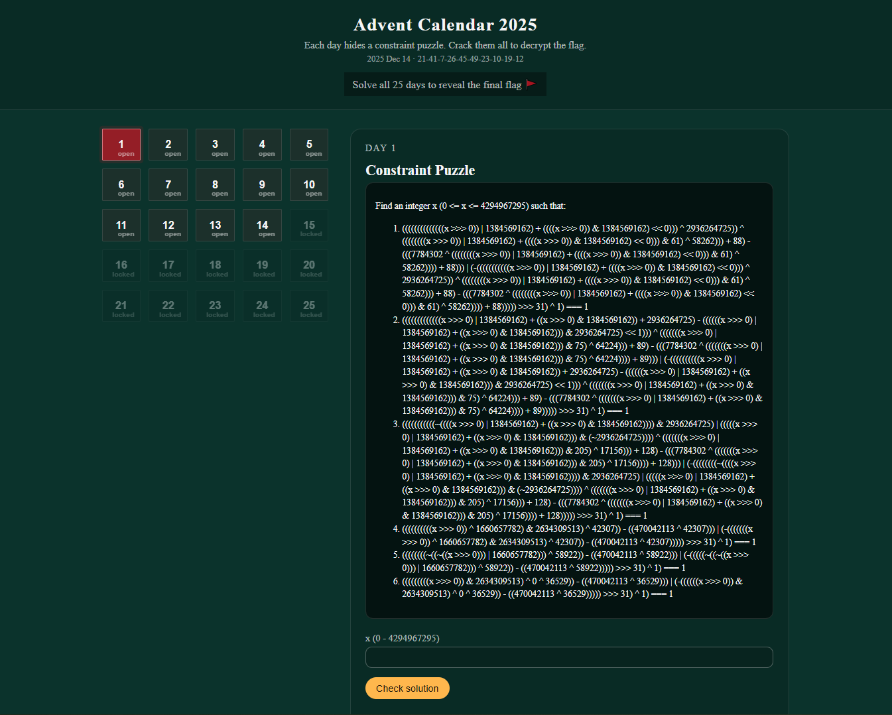

## Challenge intro

As a challenge we are given a bunch of HTML, JavaScript and CSS files. It appears to be a static website so we can start it by using Python's http module by running:

```bash
python3 -m http.server
Serving HTTP on 0.0.0.0 port 8000 (http://0.0.0.0:8000/) ...
```

Opening this page in the browser we are presented with an Advent Calendar of puzzles.



And our task is to provide an answer that would satisfy the presented set of constraints.

For example for Day 1 we should

```
Find an integer x (0 <= x <= 4294967295) such that:

((((((((((((((x >>> 0)) | 1384569162) + ((((x >>> 0)) & 1384569162) << 0))) ^ 2936264725)) ^ ((((((((x >>> 0)) | 1384569162) + ((((x >>> 0)) & 1384569162) << 0))) & 61) ^ 58262))) + 88) - (((7784302 ^ ((((((((x >>> 0)) | 1384569162) + ((((x >>> 0)) & 1384569162) << 0))) & 61) ^ 58262)))) + 88))) | (-(((((((((((x >>> 0)) | 1384569162) + ((((x >>> 0)) & 1384569162) << 0))) ^ 2936264725)) ^ ((((((((x >>> 0)) | 1384569162) + ((((x >>> 0)) & 1384569162) << 0))) & 61) ^ 58262))) + 88) - (((7784302 ^ ((((((((x >>> 0)) | 1384569162) + ((((x >>> 0)) & 1384569162) << 0))) & 61) ^ 58262)))) + 88))))) >>> 31) ^ 1) === 1
(((((((((((((x >>> 0) | 1384569162) + ((x >>> 0) & 1384569162)) + 2936264725) - ((((((x >>> 0) | 1384569162) + ((x >>> 0) & 1384569162))) & 2936264725) << 1))) ^ (((((((x >>> 0) | 1384569162) + ((x >>> 0) & 1384569162))) & 75) ^ 64224))) + 89) - (((7784302 ^ (((((((x >>> 0) | 1384569162) + ((x >>> 0) & 1384569162))) & 75) ^ 64224)))) + 89))) | (-((((((((((x >>> 0) | 1384569162) + ((x >>> 0) & 1384569162)) + 2936264725) - ((((((x >>> 0) | 1384569162) + ((x >>> 0) & 1384569162))) & 2936264725) << 1))) ^ (((((((x >>> 0) | 1384569162) + ((x >>> 0) & 1384569162))) & 75) ^ 64224))) + 89) - (((7784302 ^ (((((((x >>> 0) | 1384569162) + ((x >>> 0) & 1384569162))) & 75) ^ 64224)))) + 89))))) >>> 31) ^ 1) === 1
(((((((((((~((((x >>> 0) | 1384569162) + ((x >>> 0) & 1384569162)))) & 2936264725) | (((((x >>> 0) | 1384569162) + ((x >>> 0) & 1384569162))) & (~2936264725)))) ^ (((((((x >>> 0) | 1384569162) + ((x >>> 0) & 1384569162))) & 205) ^ 17156))) + 128) - (((7784302 ^ (((((((x >>> 0) | 1384569162) + ((x >>> 0) & 1384569162))) & 205) ^ 17156)))) + 128))) | (-((((((((~((((x >>> 0) | 1384569162) + ((x >>> 0) & 1384569162)))) & 2936264725) | (((((x >>> 0) | 1384569162) + ((x >>> 0) & 1384569162))) & (~2936264725)))) ^ (((((((x >>> 0) | 1384569162) + ((x >>> 0) & 1384569162))) & 205) ^ 17156))) + 128) - (((7784302 ^ (((((((x >>> 0) | 1384569162) + ((x >>> 0) & 1384569162))) & 205) ^ 17156)))) + 128))))) >>> 31) ^ 1) === 1
((((((((((x >>> 0)) ^ 1660657782) & 2634309513) ^ 42307)) - ((470042113 ^ 42307))) | (-(((((((x >>> 0)) ^ 1660657782) & 2634309513) ^ 42307)) - ((470042113 ^ 42307))))) >>> 31) ^ 1) === 1
((((((((~((~((x >>> 0))) | 1660657782))) ^ 58922)) - ((470042113 ^ 58922))) | (-(((((~((~((x >>> 0))) | 1660657782))) ^ 58922)) - ((470042113 ^ 58922))))) >>> 31) ^ 1) === 1
(((((((((x >>> 0)) & 2634309513) ^ 0 ^ 36529)) - ((470042113 ^ 36529))) | (-((((((x >>> 0)) & 2634309513) ^ 0 ^ 36529)) - ((470042113 ^ 36529))))) >>> 31) ^ 1) === 1
```

With a minimal set of changes - replace `>>>` with `>>` and `===` with `==` - we can quickly plug that into and Z3 to see if we can indeed solve them and we are able to progress within the game.

```python
import z3

s = z3.Solver()
x = z3.BitVec('x', 32)
s.add(((((((((((((((x >> 0)) | 1384569162) + ((((x >> 0)) & 1384569162) << 0))) ^ 2936264725)) ^ ((((((((x >> 0)) | 1384569162) + ((((x >> 0)) & 1384569162) << 0))) & 61) ^ 58262))) + 88) - (((7784302 ^ ((((((((x >> 0)) | 1384569162) + ((((x >> 0)) & 1384569162) << 0))) & 61) ^ 58262)))) + 88))) | (-(((((((((((x >> 0)) | 1384569162) + ((((x >> 0)) & 1384569162) << 0))) ^ 2936264725)) ^ ((((((((x >> 0)) | 1384569162) + ((((x >> 0)) & 1384569162) << 0))) & 61) ^ 58262))) + 88) - (((7784302 ^ ((((((((x >> 0)) | 1384569162) + ((((x >> 0)) & 1384569162) << 0))) & 61) ^ 58262)))) + 88))))) >> 31) ^ 1) == 1)
s.add((((((((((((((x >> 0) | 1384569162) + ((x >> 0) & 1384569162)) + 2936264725) - ((((((x >> 0) | 1384569162) + ((x >> 0) & 1384569162))) & 2936264725) << 1))) ^ (((((((x >> 0) | 1384569162) + ((x >> 0) & 1384569162))) & 75) ^ 64224))) + 89) - (((7784302 ^ (((((((x >> 0) | 1384569162) + ((x >> 0) & 1384569162))) & 75) ^ 64224)))) + 89))) | (-((((((((((x >> 0) | 1384569162) + ((x >> 0) & 1384569162)) + 2936264725) - ((((((x >> 0) | 1384569162) + ((x >> 0) & 1384569162))) & 2936264725) << 1))) ^ (((((((x >> 0) | 1384569162) + ((x >> 0) & 1384569162))) & 75) ^ 64224))) + 89) - (((7784302 ^ (((((((x >> 0) | 1384569162) + ((x >> 0) & 1384569162))) & 75) ^ 64224)))) + 89))))) >> 31) ^ 1) == 1)
s.add((((((((((((~((((x >> 0) | 1384569162) + ((x >> 0) & 1384569162)))) & 2936264725) | (((((x >> 0) | 1384569162) + ((x >> 0) & 1384569162))) & (~2936264725)))) ^ (((((((x >> 0) | 1384569162) + ((x >> 0) & 1384569162))) & 205) ^ 17156))) + 128) - (((7784302 ^ (((((((x >> 0) | 1384569162) + ((x >> 0) & 1384569162))) & 205) ^ 17156)))) + 128))) | (-((((((((~((((x >> 0) | 1384569162) + ((x >> 0) & 1384569162)))) & 2936264725) | (((((x >> 0) | 1384569162) + ((x >> 0) & 1384569162))) & (~2936264725)))) ^ (((((((x >> 0) | 1384569162) + ((x >> 0) & 1384569162))) & 205) ^ 17156))) + 128) - (((7784302 ^ (((((((x >> 0) | 1384569162) + ((x >> 0) & 1384569162))) & 205) ^ 17156)))) + 128))))) >> 31) ^ 1) == 1)
s.add(((((((((((x >> 0)) ^ 1660657782) & 2634309513) ^ 42307)) - ((470042113 ^ 42307))) | (-(((((((x >> 0)) ^ 1660657782) & 2634309513) ^ 42307)) - ((470042113 ^ 42307))))) >> 31) ^ 1) == 1)
s.add(((((((((~((~((x >> 0))) | 1660657782))) ^ 58922)) - ((470042113 ^ 58922))) | (-(((((~((~((x >> 0))) | 1660657782))) ^ 58922)) - ((470042113 ^ 58922))))) >> 31) ^ 1) == 1)
s.add((((((((((x >> 0)) & 2634309513) ^ 0 ^ 36529)) - ((470042113 ^ 36529))) | (-((((((x >> 0)) & 2634309513) ^ 0 ^ 36529)) - ((470042113 ^ 36529))))) >> 31) ^ 1) == 1)

if s.check() == z3.sat:
    m = s.model()
    print(':)')
    print(m[x])
else:
    print(':(')
```

Running such script gives us
```
:)
1559119409
```

And providing this value as an answer on the page, verifies it is correct and marks Day 1 as solved.

Also an important observation is that refreshing the page a couple of times we can assure they are not generated.

One could try to solve those by hand replacing the JavaScript strict operators to Python's one but there's one extra problem. We are only allowed to solve challenges that are open until Day 14 (13th during the actual competition). Further days are closed until we will reach that day.

Of course we can't wait that long to solve the challenge so we need another way.

## Solution

Since we do have all the files on our local machine, we should be able to find out the challenges for each day. Since refreshing the page doesn't change the task, they are either pre-generated or they are constructed but with some constant seed. Let's dig into the available code.

The `index.html` doesn't include anything interesting but the are 2 JavaScript files as well. They are minified but not obfuscated and inside `_next/static/chunks/app/page-fdcc665989738875.js` we can spot something interesting.

Next to the string that indicates successful solving of the daily challenge - `Correct! Day solved 🎉󠄱󠅞󠅑󠅜󠅩󠅪󠅙󠅞󠅗󠄐󠅤󠅘󠅙󠅣󠄐󠅙󠅣󠄐󠅑󠅗󠅑󠅙󠅞󠅣󠅤󠄐󠅩󠅟󠅥󠅢󠄐󠅄󠄿󠅃󠄞`, we can spot a base64 encoded string - `"uJVY4mJFB6T9yppuCdGFmTW1O5GZ06yw4OTVml4VNOw=`.
Decoding it doesn't give us anything printable but if there's one base64-encoded string maybe there's more. 

And in fact there is. Searching for `base64` we can spot another one - much larger this time starting with `"H4sIAAAAAAAC/+1...`.

Decoding it, also doesn't produce anything printable but it does give us something familiar.

It starts with bytes `\x1f\x8b` and it's a magic number for gzip compressed data. And if we decompress it via `gzip.decompress` we have what we were looking for - puzzles stored in a nice json format ready to be solved.

```json
[{"day":1,"eqExprs":["((((((((((((((x >>> 0)) | 1384569162) + ((((x >>> 0)) & 1384569162) << 0))) ^ 2936264725)) ^ ((((((((x >>> 0)) | 1384569162) + ((((x >>> 0)) & 1384569162) << 0))) & 61) ^ 58262))) + 88) - (((7784302 ^ ((((((((x >>> 0)) | 1384569162) + ((((x >>> 0)) & 1384569162) << 0))) & 61) ^ 58262)))) + 88))) | (-(((((((((((x >>> 0)) | 1384569162) + ((((x >>> 0)) & 1384569162) << 0))) ^ 2936264725)) ^ ((((((((x >>> 0)) | 1384569162) + ((((x >>> 0)) & 1384569162) << 0))) & 61) ^ 58262))) + 88) - (((7784302 ^ ((((((((x >>> 0)) | 1384569162) + ((((x >>> 0)) & 1384569162) << 0))) & 61) ^ 58262)))) + 88))))) >>> 31) ^ 1) === 1","(((((((((((((x >>> 0) | 1384569162) + ((x >>> 0) & 1384569162)) + 2936264725) - ((((((x >>> 0) | 1384569162) + ((x >>> 0) & 1384569162))) & 2936264725) << 1))) ^ (((((((x >>> 0) | 1384569162) + ((x >>> 0) & 1384569162))) & 75) ^ 64224))) + 89) - (((7784302 ^ (((((((x >>> 0) | 1384569162) + ((x >>> 0) & 1384569162))) & 75) ^ 64224)))) + 89))) | (-((((((((((x >>> 0) | 1384569162) + ((x >>> 0) & 1384569162)) + 2936264725) - ((((((x >>> 0) | 1384569162) + ((x >>> 0) & 1384569162))) & 2936264725) << 1))) ^ (((((((x >>> 0) | 1384569162) + ((x >>> 0) & 1384569162))) & 75) ^ 64224))) + 89) - (((7784302 ^ (((((((x >>> 0) | 1384569162) + ((x >>> 0) & 1384569162))) & 75) ^ 64224)))) + 89))))) >>> 31) ^ 1) === 1","(((((((((((~((((x >>> 0) | 1384569162) + ((x >>> 0) & 1384569162)))) & 2936264725) | (((((x >>> 0) | 1384569162) + ((x >>> 0) & 1384569162))) & (~2936264725)))) ^ (((((((x >>> 0) | 1384569162) + ((x >>> 0) & 1384569162))) & 205) ^ 17156))) + 128) - (((7784302 ^ (((((((x >>> 0) | 1384569162) + ((x >>> 0) & 1384569162))) & 205) ^ 17156)))) + 128))) | (-((((((((~((((x >>> 0) | 1384569162) + ((x >>> 0) & 1384569162)))) & 2936264725) | (((((x >>> 0) | 1384569162) + ((x >>> 0) & 1384569162))) & (~2936264725)))) ^ (((((((x >>> 0) | 1384569162) + ((x >>> 0) & 1384569162))) & 205) ^ 17156))) + 128) - (((7784302 ^ (((((((x >>> 0) | 1384569162) + ((x >>> 0) & 1384569162))) & 205) ^ 17156)))) + 128))))) >>> 31) ^ 1) === 1"],"maskExprs":["((((((((((x >>> 0)) ^ 1660657782) & 2634309513) ^ 42307)) - ((470042113 ^ 42307))) | (-(((((((x >>> 0)) ^ 1660657782) & 2634309513) ^ 42307)) - ((470042113 ^ 42307))))) >>> 31) ^ 1) === 1","((((((((~((~((x >>> 0))) | 1660657782))) ^ 58922)) - ((470042113 ^ 58922))) | (-(((((~((~((x >>> 0))) | 1660657782))) ^ 58922)) - ((470042113 ^ 58922))))) >>> 31) ^ 1) === 1","(((((((((x >>> 0)) & 2634309513) ^ 0 ^ 36529)) - ((470042113 ^ 36529))) | (-((((((x >>> 0)) & 2634309513) ^ 0 ^ 36529)) - ((470042113 ^ 36529))))) >>> 31) ^ 1) === 1"]},
...
```

Each day has two interesting children underneath: `eqExprs` and `masExprs`. Combining them would give us each day's set of equations to solve.

There's not that much left to do now other than to parse this and generate Z3 expressions that will give us the solution.

I've decided to parse this json and generate new Python file with solutions:

```python
t = #huge json table that also works as python table
print('import z3')
print('x = z3.BitVec("x", 32)')
for i in range(len(t)):
    e = t[i]
    expr = e['eqExprs']
    print('s = z3.Solver()')
    for exp in expr:
        v = exp.replace('>>>','>>').replace('===','==')
        print(f's.add({v})')
    expr = e['maskExprs']
    for exp in expr:
        v = exp.replace('>>>','>>').replace('===','==')
        print(f's.add({v})')
    
    print('if s.check() == z3.sat:')
    print('     m = s.model()')
    print(f'     print("Day{i+1}: ")')    
    print('     print(m[x])')
    print('else:')
    print('     print(":(")')
```

Storing the output of this program as a new Python file and running it would give us the solutions to all the daily challenges.

But we are still unable to provide them after a certain day is reached. Back to the source code.

Since we have all the files we should be able to figure out this logic. 

It should be using JavaScript's `Date` object so we can start by finding those. 

There are a couple of instances but one is particularly interesting. Close to the spot where we started the investigation we can see the particular set of methods:

```js
function Tn(t, e) {
    return !!e && 2025 === e.getFullYear() && 11 === e.getMonth() && e.getDate() >= t
}
function Rn(t, e) {
    return t ? e ? "solved" : "open" : "locked"
}
```

They look like they control which day is open - `Tn` and what is printed on the tile - `Rn`. We can check our suspicion.

One option would be to put a breakpoint and change the returned value but there's a better option. Not sure if every browser supports that but Brave - and probably all Chromium-based ones - allows us to change and save this file and return it instead of the original.

So we can simply change the body of those methods to

```js
function Tn(t, e) {
    return !!e && 2025 === e.getFullYear() && 11 === e.getMonth()
}
function Rn(t, e) {
    return e ? "solved" : "open"
}
```

and when we refresh - all the days are now open to be solved. And that gives us the flag

`Final flag: SECCON{b00l34n_4dv3nt_2025_fl4g}`

